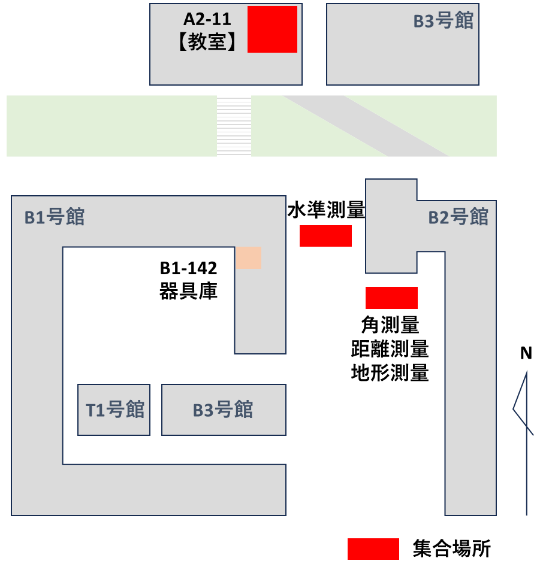

# 1.2 スケジュール・集合場所・班分け

本実習は表 1.1に示すスケジュールで実施する。天候等により授業時間が変更される可能性があるので，こまめにCNSを確認すること（大学メールへの通知が来るようにスマートフォンの設定をしてありますか？）。進行状況によっては，後半に授業時間外の実習も行う場合もあるので，アルバイト等の予定を入れないこと。

> 表 1.1　実施スケジュール

<table>
<colgroup>
<col style="width: 5%" />
<col style="width: 20%" />
<col style="width: 73%" />
</colgroup>
<thead>
<tr class="header">
<th>回</th>
<th>予定日</th>
<th>内容</th>
</tr>
</thead>
<tbody>
<tr class="odd">
<td>1</td>
<td>2025/4/17 木</td>
<td>全体説明　【教室】</td>
</tr>
<tr class="even">
<td>2</td>
<td>2025/4/24 木</td>
<td>4章 角測量 (#1)　【構内】　A1～A9班 
5章 水準測量 (#2)　【構内】　B1～B9班</td>
</tr>
<tr class="odd">
<td>3</td>
<td>2025/5/1 木</td>
<td>5章 水準測量 (#2)　【構内】　A1～A9班 
4章 角測量 (#1)　【構内】　B1～B9班</td>
</tr>
<tr class="even">
<td>4</td>
<td>2025/5/8 木</td>
<td>6章 距離測量 (#3)　【構内】　A1～A9班 
8章 GIS&amp;座標算出プログラム演習 (#4)　【教室】　B1～B9班</td>
</tr>
<tr class="odd">
<td>5</td>
<td>2025/5/15 木</td>
<td>8章 GIS&amp;座標算出プログラム演習 (#4)　【教室】　A1～A9班 
8章 GIS&amp;座標算出プログラム演習 (#4)　【教室】　B1～B9班</td>
</tr>
<tr class="even">
<td>6</td>
<td>2025/5/22 木</td>
<td>7章 地形測量｜説明　【教室】　、選点・水準測量　【現場】</td>
</tr>
<tr class="odd">
<td>7</td>
<td>2025/5/29 木</td>
<td>7章 地形測量｜水準測量　【現場】　（#5）</td>
</tr>
<tr class="even">
<td>8</td>
<td>2025/6/5 木</td>
<td>7章 地形測量｜トラバース測量　【現場】　</td>
</tr>
<tr class="odd">
<td>9</td>
<td>2025/6/12 木</td>
<td>7章 地形測量｜トラバース測量　【現場】　</td>
</tr>
<tr class="even">
<td>10</td>
<td>2025/6/19 木</td>
<td>
7章 地形測量｜細部測量　【現場】　

／　座標計算・GISで製図　【教室】（#6）
</td>
</tr>
<tr class="odd">
<td>11</td>
<td>2025/6/26 木</td>
<td>
7章 地形測量｜細部測量　【現場】　

／　座標計算・GISで製図　【教室】
</td>
</tr>
<tr class="even">
<td>12</td>
<td>2025/7/3 木</td>
<td>
7章 地形測量｜細部測量　【現場】　

／　座標計算・GISで製図　【教室】　（#7）
</td>
</tr>
<tr class="odd">
<td>13</td>
<td>2025/7/10 木</td>
<td>
7章 地形測量｜細部測量　【現場】　

／　座標計算・GISで製図　【教室】 *予備日含
</td>
</tr>
<tr class="even">
<td>14</td>
<td>2025/7/17 木</td>
<td>
7章 地形測量｜細部測量　【現場】　

／　座標計算・GISで製図　【教室】 *予備日含
</td>
</tr>
<tr class="odd">
<td>15</td>
<td>2025/7/24 木</td>
<td>
7章 地形測量｜細部測量　【現場】　

／　座標計算・GISで製図　【教室】 *予備日含
</td>
</tr>
</tbody>
</table>

(　)はレポート出題と番号。【　】は実施場所。教室：A2-11、構内：B1号館とB2号館の間、現場：八幡神社（集合は測量器具室前）

図 1.1　集合場所

　屋外での実習の日も教室（A2-11）が利用可能である。野帳の確認、レポートの作成に活用されたい。

本実習での班分けは別紙を参照してください．
