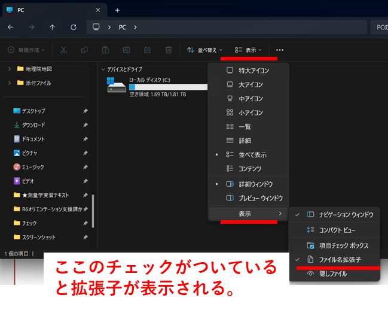

# 1.6.3 エクスプローラ上でのファイル拡張子の表示

　ファイルの種類は、拡張子と呼ばれるファイル名末尾の「.xxx」で判別される。ファイルの数・種類が多くなるGISでは重要なものとなる。初期設定では拡張子が隠されているので不便である。以下の手順で表示設定を行う。

> ・Windowsボタンを押しながらEを押して、「エクスプローラ」を表示する。
>
> ・表示→その下にある表示→ファイル名拡張子のチェックをONにする。
>
> 
