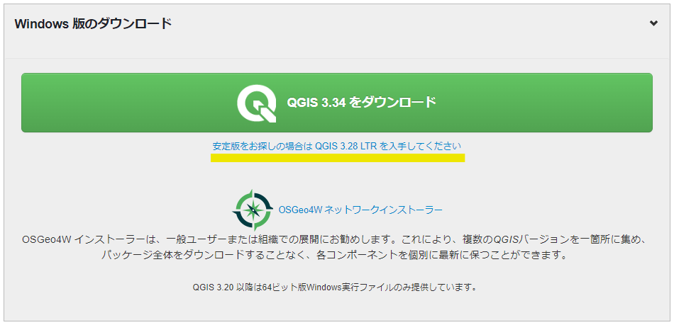

# 1.6.6 QGIS のインストール

- QGISのwebサイト（https://www.qgis.org/ja/site/forusers/download.html）へアクセスする。

- Windows版のダウンロード（あるいはmacOS版のダウンロード）を選択し、緑色で示されている「QGIS \*.\*\*をダウンロード」の下に表示されている「安定版をお探しの場合はQGIS \*.\*\*LTRを入手してください」をクリックする。\*はその時にバージョンで異なる。この後の寄付の画面は「このメッセージを閉じる」でよい。

- Windows版インストーラー「QGIS-OSGeo4W-\*.\*\*.\*\*-\*.msi」（macOS版では「qgis-macos-ltr.dmg」）の保存ウインドウが開くので、「保存」をクリックしてダウンロードする。

- ダウンロードされたインストーラーをクリック

  - QGIS \*.\*\*.\*\*-\* ‘\*\*\*\*\*\*\*’ Setupウインドウが開く

  - 「Next」をクリック

  - 「I accept the terms in the License Agreement」にチェックを入れて「Next」をクリック

  - 「Create a desktop shortcuts」と「Create a menu shortcuts」にチェックが入っていることを確認し、「Next」をクリック（インストール先のフォルダを変更しないこと）

  - 「Install」をクリック

  - 「このアプリがデバイスに変更を加えますか？」というウインドウが開いた場合、「はい」をクリック

  - 「Finish」をクリックするとインストールが完了する。
