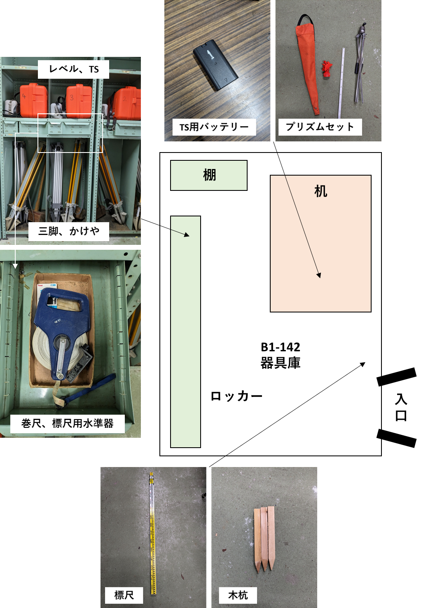

# 2.2.7 器具の返却

- 器具を実習場所に置き忘れないようにする。「貸出器具チェックリスト」と照らし合わせて図 2.1のように返却する。

- 器具を壊した場合や、異常を見つけた場合は、速やかに担当教員に申し出て指示を受けること。

- 電池・マジックがなくなった（なくなりそうな）場合、担当教員に申し出る。

- トータルステーション・レベルの返却には特別の注意がある。「３．８取り扱いの注意」を参照のこと。

> 図 2.1　器具の片づけ方
