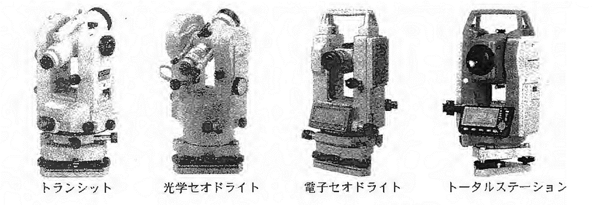
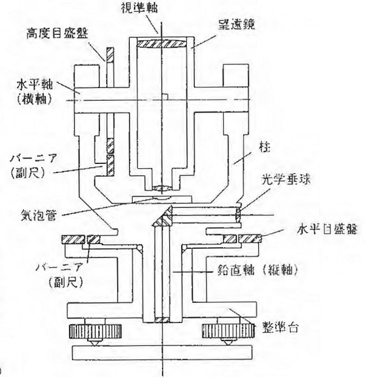
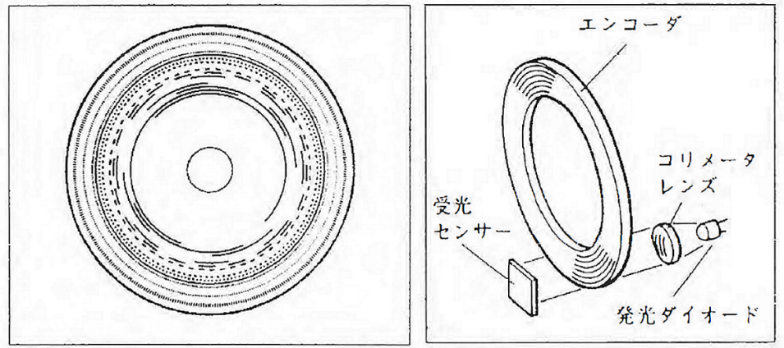
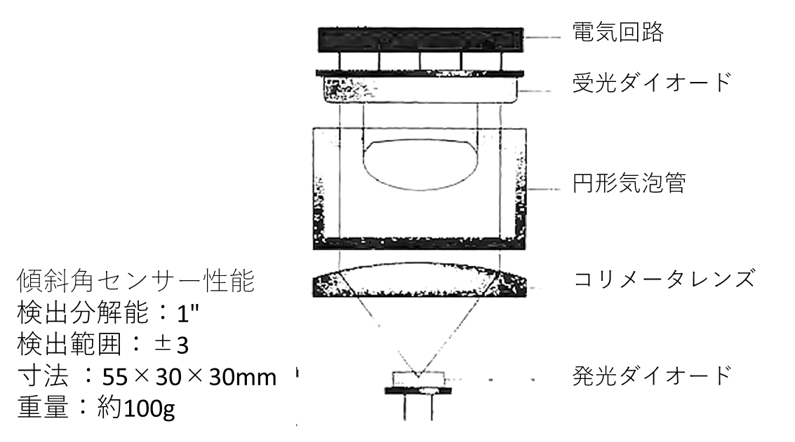
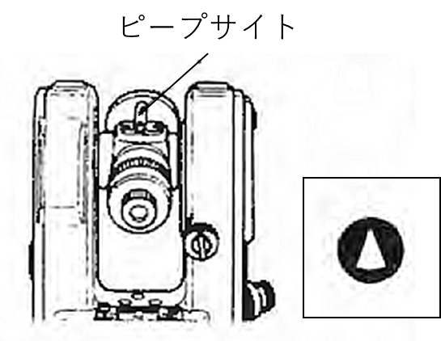

# 3.3.2 構造および測角の機構

トータルステーションの基本構造、および測角部の機構は、トランシット・セオドライトの構造と基本的に同じであり（図 3.4）、トータルステーションは望遠鏡部に光波距離計の機構が付加された点が大きな違いである。

現在では、読みとり精度の高い測角儀をセオドライトと呼び、読みとり精度の低い測角儀をトランシットと呼ぶ。トランシットの角度の読みとり方式は「バーニア読み」である。セオドライトは角度の読みとり方式の違いにより「光学セオドライト（マイクロ読み）」と「電子セオドライト（デジタル表示式）」に分けられる。

> 図 3.4　測量機器の名称と写真

## 基本構造

トランシットの基本構造は、図 3.5のように、鉛直に立ち水平方向に回転する鉛直軸（縦軸）と、鉛直軸の真上で鉛直軸に垂直に位置する水平軸（横軸）、その水平軸を軸として鉛直方向に回転する望遠鏡からなる。この2つの軸の回転により水平角と鉛直角を測定する構造となっている。

2つの軸以外に、基本的な部分として、回転量を知るための目盛盤（高度目盛盤、水平目盛盤）、遠くを拡大して正確に目標を視準するための望遠鏡、望遠鏡と水平軸を支える支柱、本体を水平にするための整準台と気泡管がある。

> 図 3.5　トランシットの基本構造

## 望遠鏡

望遠鏡は、対物レンズと接眼レンズの組み合わせで見かけの視界を拡大することと、眼に入る光の量を増やして遠くにある目標物を鮮明に見えるようにするものである。実際には何枚かの凹凸レンズの組み合わせで構成されており、目標物にピントを合わせる合焦機構（対物レンズの合焦、接眼レンズの合焦）、目標物を正確に視準するための十字線（焦点板）、目標物が逆さまに見えないようにする正位プリズムなどが内蔵されている。

### 分解力

遠方の目標を見たとき、どの程度まで細かく、明確に見分けることができるか、その能力をいう。3"の分解力をもつ望遠鏡（本実習で用いるトータルステーション）は、約100m先のl.5mmの幅を見分けることができる。（人間の肉眼による分解力は一般に60"である）

### 視界

望遠鏡を覗いたときに見える範囲。1°30'の視界（本実習で用いるトータルステーション）では、約100m先で2.6mの範囲が見える。

### 最短焦点距離

目標物に対し、ピントが合わせられる一番近い距離（機械の中心からの距離）（本実習で用いるトータルステーションは1.0m)

### 焦点板

目標物を視準する際の基準となる十字線が描かれている板。十字線にはいろいろな形状があり、スタジア線の入ったものは、スタジア測量（標尺を用いて概略の距離を測定する方法）ができる。（本実習で使用するトータルステーションにはスタジア線は無い／スタジア測量は「レベル」を参照）

## 軸

経緯儀（トランシット、セオドライト、トータルステーション）は、①鉛直に立ち、本体上部を水平に回転させる鉛直軸（縦軸）と、②鉛直軸上に位置し、かつ鉛直軸に直交する水平軸（横軸）の2つの回転する軸を持つ。

縦軸には副軸式のものと単軸式のものがある。副軸式は本体上部（望遠鏡）を水平回転させずに水平目盛盤だけを単独に回転させることができるが、単軸式は水平目盛盤を単独に回転することが出来ない（本実習で用いるトータルステーションは単軸式）。現在では目盛盤の分画は極めて高精度であり、さらに単軸式は回転部分が少ないので高精度加工に適しているという利点から、高精度の経緯儀のほとんどが単軸型である。

## 目盛盤（分度盤）

目盛盤には、水平角を測定するための「水平目盛盤」と鉛直角を測定するための「高度目盛盤」がある。どちらも基本的な機能、構造は同じである。目盛盤を機能、構造で分類すると、目視で目盛りを読み取るガラス目盛盤（過去には金属目盛盤）とデジタル表示、ロータリーエンコーダ方式がある。

ロータリーエンコーダの角度検出方法はアブソリュート方式とインクリメンタル方式の2つに大別される。実習で用いるトータルステーションはアブソリュート方式である。アブソリュートとは「絶対的」の意味であり、図 3.6のようなパターンが目盛盤に描かれている。このパターンによって目盛盤のどの方位を見ているかが直ちに分かる。発光ダイオードと受光センサーとの間にパターンがある場合は、発光ダイオードから出た光は遮られる。パターンが無い場合には発光ダイオードは光を受けてそれを電気信号に変換する。目盛盤の各方位に半径に沿うパターンの分布が異なるので、それに応じた電気信号の形を見れば目盛盤上の方向を（絶対的に）特定できる。

> 
>
> 図 3.6　トランシットの基本構造(左：目盛盤、右：構造)

## 気泡管と補正機構

測量機を使用して観測を行う場合、本体を水平にする整準の作業が必ず必要となる。この整準の際に使用するのが気泡管である。内面が円弧になったガラス管にアルコールとエーテルの混合液を入れてあり、地球の重力方向に対して垂直＝水平を検出することができる。形状から円形気泡管と棒状気泡管がある。また取り付け箇所により縦気泡管、横気泡管、望遠鏡（遠鏡）気泡管などに分けられる。感度は、40"/2mmのように表される。これは気泡が2mmずれたとき、40"傾いているという意味である。

本体を整準する作業は、気泡管を用いて行うが、完全に本体を整準させることは難しい。鉛直軸が鉛直に立っていないときの誤差を鉛直軸誤差といい、正反観測では消去できない。そこで、高精度の観測を行うために、気泡管とは別に本体の傾きを補正する機構が内蔵されるようになった。

2軸傾斜センサー（本実習で用いるトータルステーションの補正機構、図 3.7）では、発光ダイオードから出た光が円形気泡管を透過し、受光基板内に十字型に配置された4つの受光ダイオードに届く。機械本体が完全に整準されている場合は、気泡は受光部の中央にあるが、少しでも傾斜しているとその傾斜に応じて気泡が移動する。この気泡の移動によって、各受光ダイオードが受ける光量が変化するので、受光した光量の比を計算することでその傾斜角が求められる。本実習で用いるトータルステーションの2軸傾斜センサーは、水平から±3分以内に整準されたとき機能し、5秒以内の精度（標準偏差）まで水平角・鉛直角を補正する。

> 図 3.7　2軸傾斜センサーの構造

## その他（据え付け（整準・致心）、視準のための機構）

### 整準ねじ

本体を整準するための機構。3本のねじを回転させて本体の傾きを変える。

### 光学垂球

機械の鉛直軸（縦軸）が測点の中心を通るように、機械を設置する作業＝致心（求心）作業で用いる望遠鏡。覗くと機械の真下が見える。2~5倍に倍率で内部に機械の中心点がわかるような焦点板をもつ。焦点板の中心が鉛直軸の中心の位置を指示する。整準が正しく行われていれば焦点板の中心と測点が一致したとき、機械の鉛直軸は測点の中心を通る（致心が完了したことを確認できる）。光学垂球を使わずに機械の中心から垂球（下げ振り）を垂らし、測点上に機械を設置する方法もある。

### シフティング式整準台（本実習で用いるトータルステーションの機構）

本体の整準（水平だし）をする機構を整準台といい、整準台は脱着式とシフティング式の2種がある。シフティング式は、本体が整準台の上で前後左右に平行移動できる機構である。整準作業のあと、致心（求心）に若干のズレを生じたとき、シフティングの機構によって、整準を保持したまま致心（求心）ができる。

### ピープサイト（図 3.8）

望遠鏡の筒の上に、視準軸に並行に取り付けられている。望遠鏡をおおよそ目標物の方向に向ける際に使用する。ピープサイトの対物側には、目印になる三角形のターゲットがあり、このターゲットを目標物に合わせるようにする。

> 図 3.8　ピープサイト

### 固定ねじ・微動ねじ

本体の水平方向の回転や望遠鏡の回転を固定または微動させるためのねじ。固定ねじを締めると機械の回転部分が固定され、微動ねじで方向の微調整ができるようになる。固定ねじを締めないで微動ねじを回しても微動しない。単軸の場合は望遠鏡固定ねじ・微動ねじと水平固定ねじ・微動ねじがある。  
※固定ねじは強く締めすぎないように注意すること！

視準時の一般的な使い方：

- 望遠鏡固定ねじ、水平固定ねじを緩める。

- ピープサイトで望遠鏡を目標物の方向におおよそ向けて、両ねじを締める。

- 望遠鏡を覗き、望遠鏡微動ねじ、水平微動ねじを使って目標物を十字線の中央に正確に導く。
