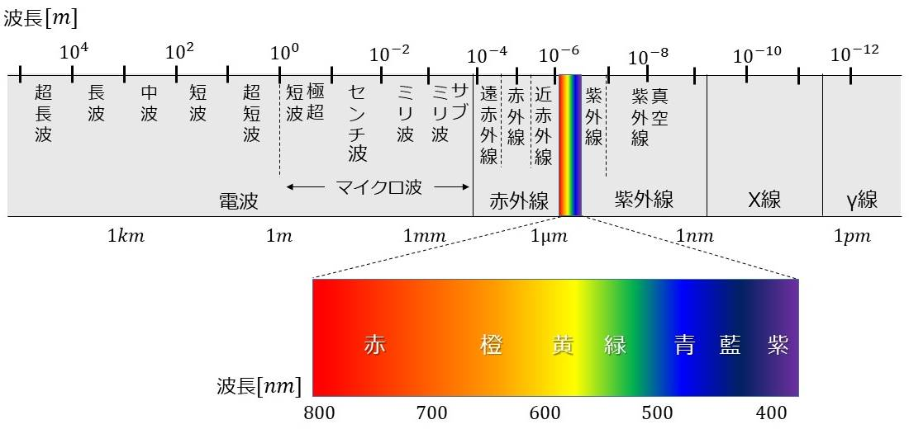
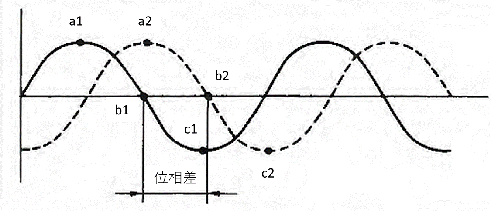
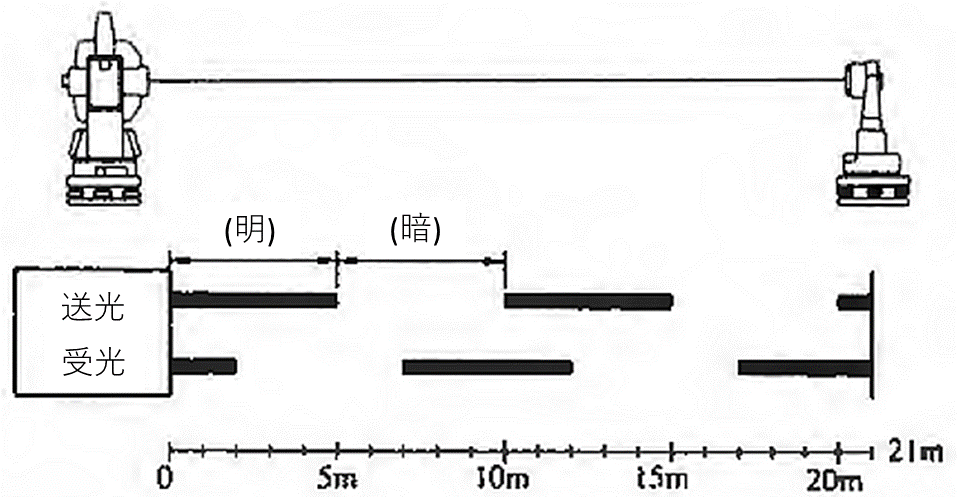
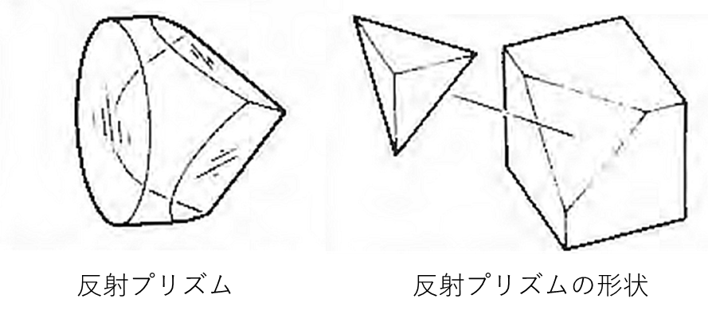
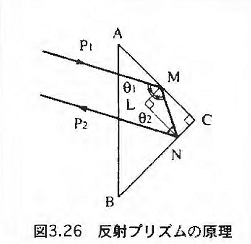
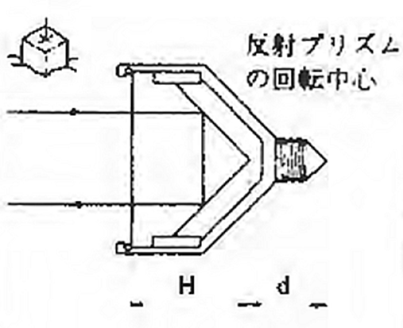
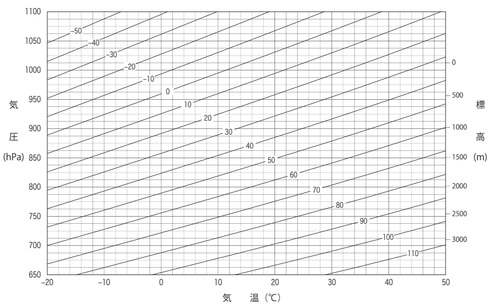

# 3.3.3 測距の機構（光波距離計としての機能）

トータルステーションの測距部の機構は光波距離計の機構と基本的に同じである。この機構が望遠鏡筒の内部に組み込まれている。光波距離計は目標点に光を投射し、反射して機械に戻ってきた光を電子的に解析して距離を測る機械である。したがって目標点に設置する反射プリズムとともに使用する。巻尺などによる距離測定と比べて、下記のような特長を持っている。

- 1回の測定で数mから数kmまで高精度の距離測定ができる。（精度は1kmで1cm以下）

- 小人数（1～2人）で作業が行える。

- 機械と反射プリズムを設置すれば、短時間（数秒）で距離がわかる。

- 機械点から反射プリズムが規準できれば、途中の地形の影響を受けない。

- 簡単なキー操作のみで誰にでも扱え、機械も軽量・小型化されている。

- 温度と気圧による気象補正計算や、長距離測定の際に影響がある面差（球差と気差）の補正計算は、機械が自動的に計算するため、巻尺を使用した場合の傾斜補正や温度補正などの計算が不要。

## 種類

位相差方式とパルス方式の2つがある。

位相差測定方式は、一定周期で強弱を変化させた（振幅変調された）測距光を用いる。距離計から発せられた光と、これがターゲットから反射して戻ってきた光の間には、その距離に応じた位相差が生じる。この位相差から距離を求める方式である。測定したい最大距離に応じて、複数の変調周波数を用いる。（本実習で用いるトータルステーションは位相差方式）

パルス方式は、ごく短い時間点灯させたパルス測距光を用いる。点灯した時刻と、このパルス光がターゲットから反射して戻ってきた時刻の差から距離値を求める。

ノンプリズム光波距離計とは、文字どおり反射プリズム等ターゲットを必要としない光波距離計のことである。測距光にはレーザ光を用いる。使用されるレーザ光は直接覗き込むことをしなければ特別な危険はないが、故意に人や動物に向けてレーザ光を照射してはならない。本実習で用いるトータルステーションはプリズム光波距離計であり、発光ダイオードの近赤外光を用いている。

## 測定原理

光波距離計の測距光の光源には発光ダイオードの一種であるGa-As(ガリウム・砒素)ダイオードが使われるのが一般的で、これは電流を光(近赤外光)に変換する素子である。測距で用いられるレーザ光には近赤外光が用いられる。近赤外光の波長は750-900nmで（図 3.9）、可視光よりも波長が長いために空気中の透過力が大きいという特長を持つ。また、レーザ光とは異なり、人体に対して全く無害であるが長時間故意に見ない方が良い。

> 図 3.9　電磁波の波長と振動数

（光学技術の基礎用語-光と光学に関連する用語の解説サイト-、<https://www.optics-words.com/kogaku_kiso/wavelength.html>、2023/12/30閲覧）

光の速さはおよそ30万km／秒と非常に速いため、光の往復時間が極度に短く、それを測って距離を求めるのは、困難である。その代わりに、通常の光波距離計は、光に特定の周期で明暗の変化をつけ（変調するという）、その位相差を測定して距離を測る方式を採用している。

連続して光が投射されている場合、投射光と帰還光の位相関係は測定距離に関係し、しかも、時間に関係なく一定であることを利用する。位相差とは、同じ周波数の2つの交流波で、それぞれの波の最大値(または最小値)間の差をいう。(図 3.10で、al点からa2点、またはb1点からb2点までの差で、c1点からc2点までの差も同じ。)

> 図 3.10　光の位相差

まず、発光ダイオードをある周波数*f*で点滅させると明暗を繰り返す光が機械から送り出される。このときの明暗の間隔（波長）を$\lambda$とすると、

$$\lambda = c/f$$

ここに、$\lambda$: 光の波長、$c$: 光速、$f$: 光の振動数である。仮に、$f$ =30(MHz)とすると、波長$\lambda$は=10mとなり、明と暗の長さはそれぞれ5mとなる。図 3.11に例として、機械から21mの距離に反射プリズムを置いたときのある時点における測距光の様子を示す。注：実際には異なる周波数の光を複数用いている。

1)  送先側の信号（Hのときが明、Lのとき暗）

2)  受光側の信号（Hのときが明、Lのとき暗）

3)  (b)の信号がLからHに変わったときから(a)の信号がLからHに変わるときまで（2つの信号の位相差）に発生する信号。  
    →位相差による測距信号

4)  水晶発振器による信号幅が非常に細かいパルスである。

5)  (c)の信号が発生している間だけ、(d)のパルスを取り出す。このパルスの数によって距離を計算する。

> 図 3.11　位相差の測定

実際の電子回路内において、(a)、(b)、(c)のような高周波信号は、位相を変えずに周波数を低く（周波数ミキシング）して、電子的処理ができるようにしている。(c)の信号の幅は、(b)の信号の立ち上がりから(a)の信号の立ち上がりまでであるので、最大でも1波長分の長さである。これは、機械と反射プリズムとの往復の距離の中で何個の明暗の波があることを機械は知ることはできないということを意味する。

また、測距光は機械と反射プリズム間を往復するために、実際に測定する距離の2倍の距離に対応した位相差が検出される。つまり、1波長が10mの測距光のみでは最大5mの距離までしか測定できないということになる。

この例では、実際の距離は21mであるのに、位相差による測定はl mとなる。

そこで、短距離用と長距離用の数種の周波数によって明暗の長さ、すなわち波長$\lambda$を変化させて、それぞれの1/2波長の距離を測る。仮に、振動数を15(MHz)にすると、波長$\lambda$は20mとなり、10m（=$\lambda/2$）までの距離を測ることができる。15(MHz)の1つの周波数だけでは実際の距離が729.825mでも9.825mとしか計算されないので、10m以上の距離については周波数を変えて、例えば150(kHz)にして1kmまでの距離が測れるようにする。ただし、この長距離用の低い周波数では電子回路の最小分解能が数10cmの単位と大きくなるので、最終的な距離は2種類の周波数による距離を突き合わせて表示する。

また、振動数を75(kHz)にすれば2kmまでの距離が位相差によって測れるが、測定距離が2kmを越える中距離型の機械では、周波数が少し異なる2つの長距離用周波数を使い、その差の周波数によって長距離の測定を可能にしている。

ここでは、測定原理を解説するために簡単な数値例を使ったが、実際の位相測定の精度は極めて高く、1周期の1/300から1/1000の細かさで測定が可能である。それに応じて、測距分解能もmmの水準に達している。

## 反射プリズム

反射プリズムとは、観測点に設置して光波距離計からの測距光を光波距離計に返すものである。

### 原理

普通の平面鏡でも光波距離計からの光をただ単に反射させることはできるが、たとえ数mの短い距離であっても光を光波距離計に戻すことは非常に困難である。反射プリズムは、完全に正対（測距光に対して反射プリズムの表面が垂直に向いている状態）していなくても光波距離計に測距光を戻せるという機能を持つ。この機能により、数km隔たっている距離計に正確に反射光を戻せる。図 3.12のように立方体の角の部分を切り取った形（直交3面）をしている。反射プリズムは光波距離計用のみでなく、身近なところでも使われており、自動車や自転車の後方に取り付けられている反射板も小さな反射プリズムを集めたものである。

> 図 3.12　反射プリズムと形状

図 3.13は反射プリズムに斜め方向から測距光が入り、同じ方向に反射されることを表す図である。三角形ABCはプリズム断面で、$\angle C =$<!-- -->90゜の直角三角形である。入射光Plが反射面と当たる2点をそれぞれMとNとする。また、MLとNLは、反射点MとNにおける反射面に対するMCとLN、LMとNCはそれぞれ平行であるから、

$$\angle CMN = \angle LNP_{2} = \angle ANP_{1} = \theta_{2}$$

となり、反射光は入射光と平行になる。以上は、二次元の場合の説明である。実物は、3枚の反射面をもつ三次元の物体であるが、入射光はこれら3枚の反射面への入射・反射を順次くりかえし、二次元のときと同じように、入射光と反射光の平行性が実現する。

> 図 3.13　反射プリズムの原理

### プリズム定数

光がガラスの中を通過するときの速度は空気中よりも屈折率分だけ遅くなり、光波距離計は、その分だけ実際の距離よりも長い距離を表示する。このため、ガラスの屈折率と反射プリズムの大きさ（光路の長さ）から決まる定数を引く必要がある。

さらに、反射プリズム頂点が測点の鉛直線上にあれば、プリズム（ガラス）の屈折率による補正のみで定数は決まるが、実際には反射プリズム全体の構造上からプリズム頂点の位置は光学垂球の規準線から外れているのが普通なので、そのずれ分も加減する必要がある。

以上の2つの補正すべき定数を一つにまとめてプリズム定数と呼ばれるもので、この定数は製品によって数種類ある。また、同一製品でもスペーサを着脱することにより、プリズム定数が変更できるものもある。光波距離計で距離測定するときは、使用する反射プリズムのプリズム定数と機械に入力されているプリズム定数が一致していることを確認する。図 3.14において、プリズム定数$P$は次式で表される。

$$P = - \left\{ H \times (n - 1) - d \right\}$$

ここに、$H$：プリズムの高さ、$n$：プリズム（ガラス）の屈折率（約1.5) 、$d$：プリズム頂点から回転中心（求心点上）までの距離である。なお、本実習で用いる反射プリズム（SOKKIA、CPS11P）のプリズム定数$P$は、$P = 0$である。

> 図 3.14　プリズム定数

### 反射プリズムの種類

光波距離計から出る測距光は遠距離になるにつれて拡がるので、一つの反射プリズムでは返ってくる光の量が減る。そこで長距離の距離測定では複数の反射プリズムを用いる。逆に、100m以下の近距離ではポールと円形気泡管と一体になったコンパクト反射プリズムを使用することができる。本実習ではコンパクト型を用いる。

### 測距精度

光波距離計の距離精度は、下記のような表示で統一されている。

$$\pm (A + Bppm \times D)mm$$

ここに、$A$は測定距離に関係ない誤差で、この誤差の要因は位相測定誤差や機械内部の電気的・光学的な変動などである。$B$は測定距離に依存する誤差で、誤差の要因は大気による測距光の屈折や測距光の周波数の変動などである。ppmは"100万分の1"で、1kmは100万mmであるから、$D$ kmにおける距離精度を知るには$B\ $の値に$D\ $(km)の値を乗じて、$A$ (mm)の値を加えればよい。例として、$\pm (3 + 2ppm \times D)mm$の距離精度をもつ光波距離計で5kmの距離測定を行う場合の精度は、$\pm 13mm$となる。

### 気温と気圧による誤差（気象補正係数）

光波距離計の測距光は大気中を通るため、大気の状態によって速度が異なり、測距精度に影響を及ぼす。光波距離計は、ある特定の気温と気圧（本機の場合は1013hPa、15℃）のもとで正しい距離を測定するように調整されているので、この気象条件から外れた環境下で測定を行うと、測定距離に比例して誤差が大きくなる。この誤差を消去するために、光波距離計には気象補正計算機能があり、気温と気圧で決まる気象補正値または気温と気圧を直接入力することにより、機械が自動的に気象補正の計算を行い補正後の距離を表示する。本実習で用いるトータルステーションでは、気温と気圧の直接入力と気象補正表（図 3.15）を参照して気象補正値(ppm)を入力する2通りの方法が選択可能である。

> 

図 3.15　気温気圧ごとの気象補正係数を表す気象補正表
