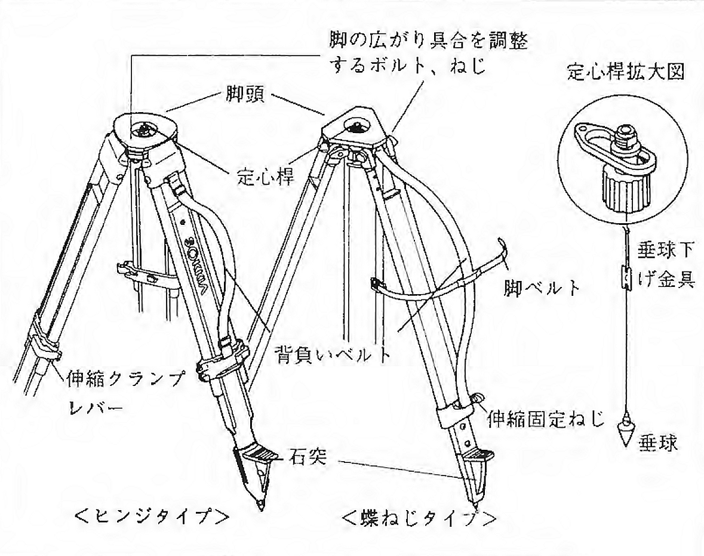

# 3.3.4 三脚

トータルステーション本体は三脚に載せて使用する。三脚の各部の名称は図 3.16の通りであり、本実習では蝶ねじタイプを用いる。脚頭と本体の間に塵など異物が挟まると正確な測定を行えないので、本体を直接地面の上に置いてはいけない。本体を箱から取り出したら直ちに三脚の上に置く。

本体と三脚は定心桿（ていしんかん）によって固定される。実習で使用するトータルステーションはシフティング式のため、本体がスライドするとき光学垂球による真下の視界を確保するため定心かんの径は大口径（*φ*\>=35mm)となっている。

> 図 3.16　三脚（トータルステーション用）
