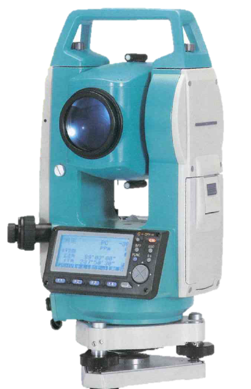

# 3.3 トータルステーション

トータルステーションとは、1台の機械で、角度（水平角・鉛直角）と距離を同時に測定する電子式測距測角儀で、①測角望遠鏡の光軸（視準軸）と光波距離計の光軸が同軸になっていること、②電子的に処理された測定データが外部機器（コンピュータ）に出力できることの2点が最大の特徴である。日本では1980年代半ばから一般に普及し現在では標準的な測距測角儀となっている。

> 図 3.2　トータルステーション（SOKKIA（ソキア）SET510S）
