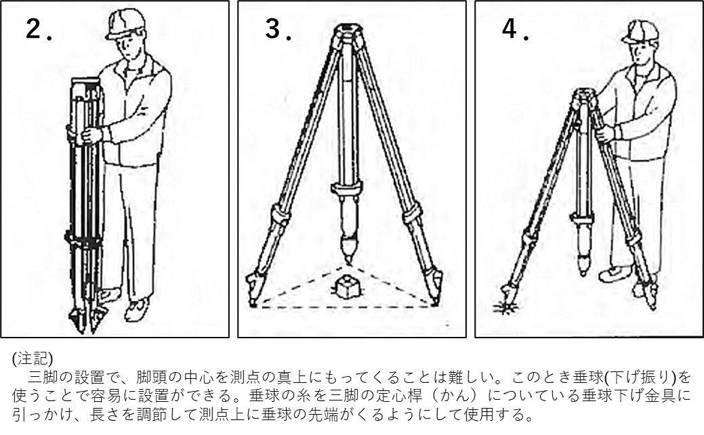
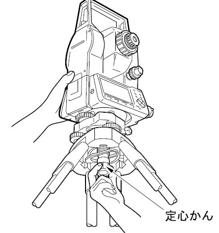
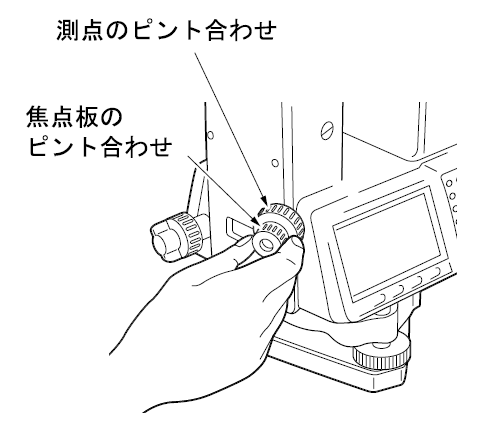
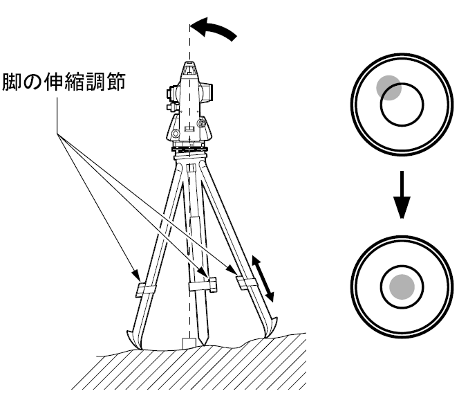
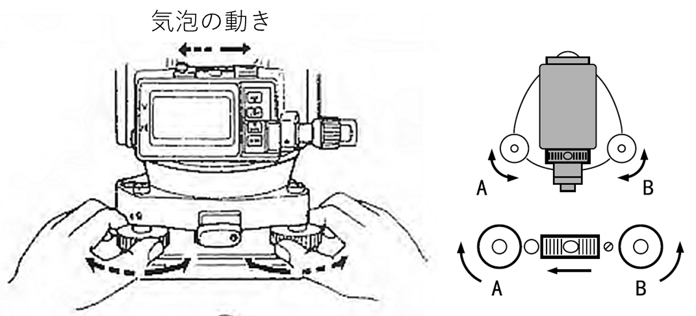
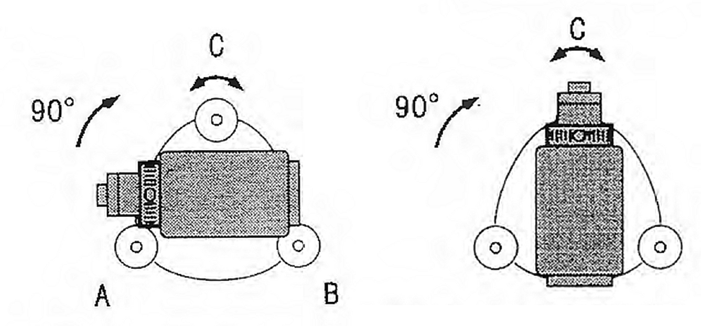
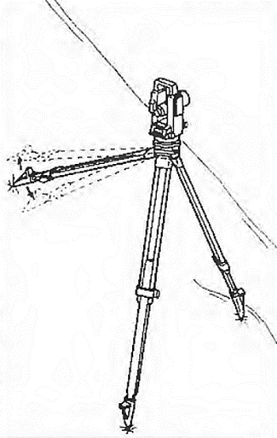

# 3.4.1 据え付け（整準と致心）

## 三脚の設置

- 脚を束ねている脚ベルトをはずす。

- 脚を広げずに立て、伸縮固定ねじ3本を緩め、3本を均等に伸ばす。この時、測定者の胸から首の範囲の高さまで伸ばすと、脚を広げて機械を設置したときに、観測しやすい高さとなる。（図 3.18　２．）

- 脚の先端がほぼ正三角形になるように等間隔に開き、測点が正三角形の中心にくるように置く。（図 3.18　３．および図中注記）。さらに、脚頭が水平になるようにする。さらに、観測者が立つ位置に三角形の底辺がくるようにすると観測時に脚が邪魔にならない。

- l本の脚をしっかりと踏み込み、残りの2本で脚頭が水平になるように注意しながら、2本とも踏み込む。（図 3.18　４．）

> 図 3.18　三脚の設置

## 機械を三脚に載せる

機械を脚頭上に載せる。片手で機械を支え、機械の底板にある雌ねじに三脚の定心かんをねじ込んで固定する。定心かんをねじ込んで固定する。（図 3.19）

> 図 3.19　機械を三脚に載せる1)

## 測点にピントを合わせる

求心望遠鏡をのぞき、求心望遠鏡接眼レンズつまみを回して焦点板の二重丸にピントを合わせる。次に求心望遠鏡合焦つまみを回して測点にピントを合わせる。（図 3.20）

> 
>
> 図 3.20　望遠鏡のピント合わせ

## 測点を求心望遠鏡の2重丸の中央に入れる

整準ねじを使って測点を求心望遠鏡の二重丸の中央に入れる。

## 円形気泡管の気泡を中央に入れる

円形気泡管の気泡の寄っている方向に最も近い三脚の脚を縮めるか、または最も遠い脚を伸ばして気泡管を中央に寄せ、さらに他の1本の脚の伸縮によって気泡を中央に入れる。気泡管と整準ねじを使って本体を整準する。（図 3.21）

> 図 3.21　円形気泡管の気泡を中央に入れる

## 横気泡管の気泡を中央に入れる

水平固定つまみをゆるめ、機械上部を回転させて、横気泡管を整準ねじA、Bと平行にする。整準ねじA、Bを使って気泡を中央に入れる。気泡は時計回りに回転した整準ねじ方向に動く。（図 3.22）

> 図 3.22　横気泡管の気泡を中央に入れる

## 90度回転させ、横気泡管の気泡を中央に入れる

機械上部を90゜回転させる。横気泡管が整準ねじA、B方向と直角になる。整準ねじCを使って気泡を中央に入れる。（図 3.23左）

## さらに90度回転させ、AB横気泡管の気泡の位置を確認する

> 機械上部をさらに90゜回転させ、気泡が中央のまま動かないことを確認する。気泡が中央にない場合には、整準ねじA、Bを逆方向に同量回転させてずれ量の半分を戻し、再び機械上部を90゜回転させ、整準ねじCを使ってこの方向でのずれ量の半分を戻す。または、横気泡管の調整を行う。（調整する場合は担当教員に申し出るように）（図 3.23右）

> 図 3.23　90度回転させ気泡を中央に入れ、さらに90度回転させ気泡を確認

## どの方向でも気泡が同じ位置（中央）にあることを確認する

機械を回転させ、どの方向でも気泡が同じ位置になることを確かめる。気泡が同じ位置にならない場合は整準作業を繰り返し行う。

## 再び測点を求心望遠鏡の二重丸の中心に入れる

シフティングクランプをゆるめ、求心望遠鏡を覗きながら二重丸の中心に測点が入るよう本体を移動させる（本体は±8mmの範囲内で水平に自由に移動する）。

## 横気泡管の気泡が中央にあることを再度確認する

気泡が中央にない場合は手順（６）に戻る

- 補足1：急勾配の斜面に三脚を設置する  
  山間部で測量機を設置する場合には、平坦地がなく斜面上に据えることが多い。傾斜地で三脚を設置する際に、三脚を均一に伸ばしてからでは、なかなか脚頭面の水平が出せない。このような場合には、図 3.24に示すように、2本の脚をほぼ均等に延ばし、斜面の下側に広げて踏み込み、他の1本を短めにして脚頭面が水平になるように調整すると比較的簡単に設置できる。

図 3.24　斜面での三脚設置

- 補足2：測点が三脚を踏み込んだ地面よりかなり高い位置にあるとき

三脚の設置で、脚頭を出来る限り水平にすること。図 3.18がポイントです。そうしないと光学垂球を用いた致心整準がうまくできません。
