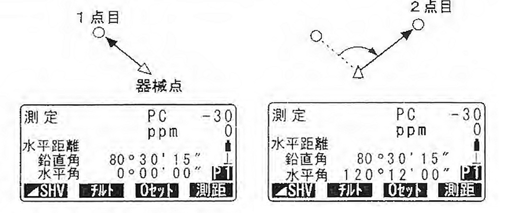
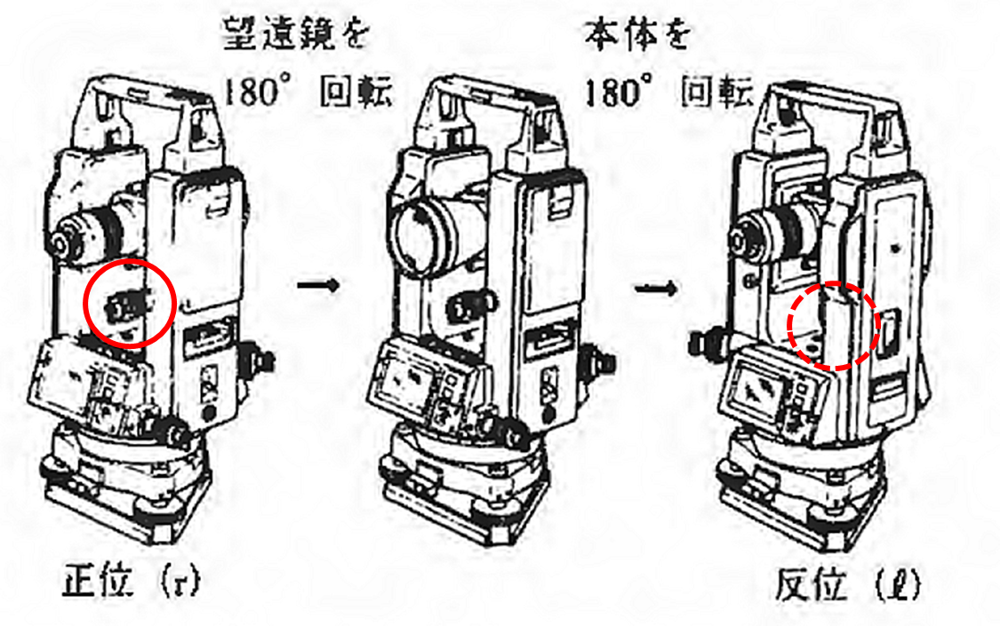
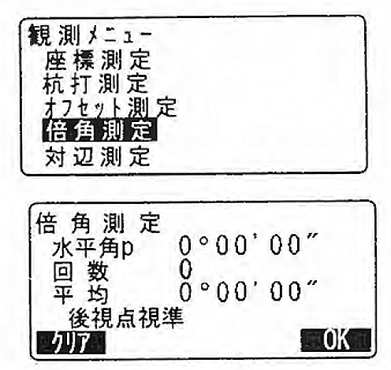
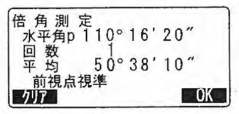

# 3.4.8 角度の測定

経緯儀を用いた角測量において生じる誤差とその消去法を整理したものが表 3.3である。この表に示すように、従来は、正反測定や倍角法によって誤差を消去していたが、本実習で用いるトータルステーションは2軸補正機能と視準軸のコリメーション補正機能を持ち、さらに目盛盤の分画誤差も無視し得るほど小さいので、正反の1対回観測や反復法（倍角法、3倍角法）を行わなくても機械誤差を気にしなくてよい。

旧型の機械を使用する場合には、正反観測が必ず必要であり、より高い精度を求めたい場合は倍角法などの反復法を行うことが望ましい。また、このような補正機能をもっている機械を使う場合でも、より高い精度を求めたい場合は、正反観測は効果的である。また複軸型でなければ本来の倍角法は行えないが、単軸型で便宜的に行う倍角法について記した。

表 3.3　角測量の誤差と消去法

<table>
<colgroup>
<col style="width: 5%" />
<col style="width: 16%" />
<col style="width: 37%" />
<col style="width: 40%" />
</colgroup>
<thead>
<tr class="header">
<th colspan="2">誤差の種類</th>
<th>従来の消去法</th>
<th>本機の消去機構</th>
</tr>
</thead>
<tbody>
<tr class="odd">
<td colspan="2">目盛盤の 
偏心誤差</td>
<td>180度対向した位置を読み平均する</td>
<td>対向検出しその平均値を自動表示</td>
</tr>
<tr class="even">
<td colspan="2">目盛りの 
分画誤差</td>
<td>消去はできないが倍角法によって目盛盤の広い範囲を使い誤差を小さくする</td>
<td>高精度の印刷技術によって誤差は無視できる</td>
</tr>
<tr class="odd">
<td rowspan="3">三軸誤差</td>
<td>鉛直軸誤差</td>
<td>消去できない</td>
<td>2軸自動補正機構により測定角誤差を5"以内に補正</td>
</tr>
<tr class="even">
<td>水平軸誤差</td>
<td>正位と反位による対回観測</td>
<td>2軸自動補正機構により測定角誤差を5"以内に補正</td>
</tr>
<tr class="odd">
<td>視準軸誤差</td>
<td>正位と反位による対回観測</td>
<td>コリメーション補正機能により測定角誤差を5"以内に補正</td>
</tr>
<tr class="even">
<td colspan="2">視準軸の 
偏心誤差</td>
<td>正位と反位による対回観測</td>
<td>コリメーション補正機能により測定角誤差を5"以内に補正</td>
</tr>
</tbody>
</table>

## 

## 正位のみの単測法（図 3.26）

2点間の夾角を測るには、「水平角の0゜設定」の機能を用います。

> ・1点目を視準する
>
> ・1点目を水平角0゜に設定する
>
> 測定モード1ページ目で【0セット】を1回押すと、【0セット】が点滅します。続いてもう一度押すと、1点自の水平角が0゜に設定されます。
>
> ・2点目を視準する

画面に表示されている水平角が、2点間の夾角となる。

（注意）：過誤を防ぐために2回～数回の測定が望ましい。

図 3.26　角測量時のトータルステーションの画面表示

## 正反1対回による単測法

（１）で表示された「正位の測定角」を野帳に記入した後、

> ・望遠鏡を右回し（角度が増える方向）に回して反位にする（図 3.27）
>
> ・1点目を視準して、その読みを野帳に記入する。
>
> ・2点目を視準して、その読みを野帳に記入する。
>
> ・2点目―1点目の値を計算し、反位の観測値（夾角）を得る．

図 3.27　トータルステーションの正位と反位

## 正位のみの倍角法

より高精度に水平角を求める場合に倍角測定を行う。

・倍角メニューに入る

測定モード3ページ目で【メニュー】を押し、「倍角測定」を選択します。

・1点目を視準する

1点目を視準して、【OK】を押します。

・2点目を視準する

2点目を視準して、【OK】を押します。

・1点目をもう一度視準する

1点目をもう一度視準して\[OK\]を押します。

・2点目をもう一度視準する

2点目をもう一度視準して、【OK】を押します。画面の「水平角p」に水平角の累積値が、「平均」に水平角の平均値が表示されます。【クリア】を押すと、1回前の1点目の測定に戻ります（「後視点視準」の表示があるときに有効）。

・さらに倍角測定を続ける場合は、手順3~4を繰り返す。

・〔ESC〕を押して倍角測定を終了。

## 正反1対回による倍角法

上記に続けて、

・望遠鏡を反位にする。

・（３）を同様に行う。

・較差、倍角差が制限値以内かチェックし、 OKなら平均して夾角を求める。

倍角差とは、｜第n回の倍角｜-｜第n+l回の倍角｜。
