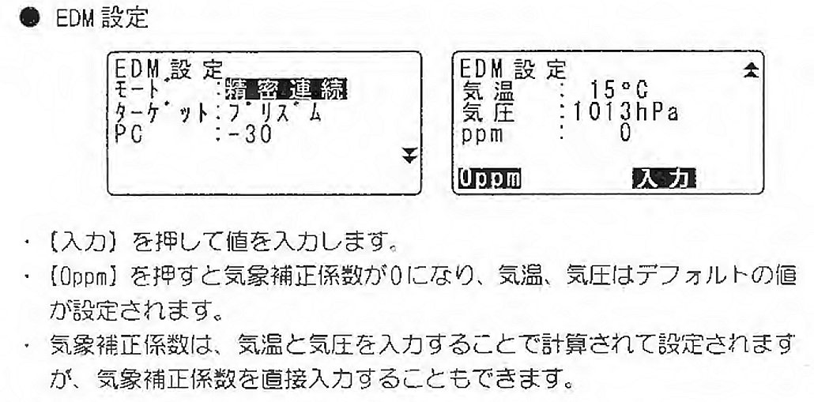
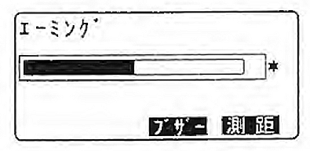
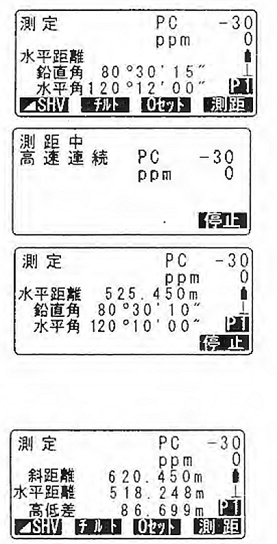

# 3.4.9 距離の測定

## 準備：気象補正係数を入力

・EDM設定から入力を行う。（EDM：Electro-optical Distance Measurement）

・【入力】を押して気温と気圧の値を入力する。

・【0ppm】を押すと気象補正係数が0になり、気温、気圧はデフォルト値が設定される。

（注意）：距離測定モードは精密連続、ターゲットタイプはプリズム、プリズム定数(PC) は0 ppmとなっているのを確認し、もし変更されていればこれに変えること。

## 受光量のチェック

・測定モードにソフトキー【光量】を割り付ける

・ターゲットを正確に視準する

・【光量】を押す。

・\<エーミング\>が表示され、受光光量がゲージで表示される。ゲージが多いほど、反射光量が多いことを表す。

・「\*」は、測定に十分なだけの光量があることを表します。「\*」が表示されないときは、もう一度ターゲットを正確に視準し直してください。

・受光光量のチェックを終了する。

・〔ESC〕を押すと、チェックを終了して測定モードに戻る。

## 距離と角度の同時測定

・ターゲットを視準する

・測定を開始する。

・測定モード1ページ目で【測距】を押して測定を開始する。

測距開始時に、EDM情報(距離測定モード、プリズム定数補正値、ppm値)が点滅表示される。

測定した距離、鉛直角、水平角が表示される。

・【停止】を押して、測距を終了。

・【◢SHV】を押すと、表示が斜距離・鉛直角、水平角/斜距離、水平距離、高低差/水平距離、高低差、水平角に切り替わる。
