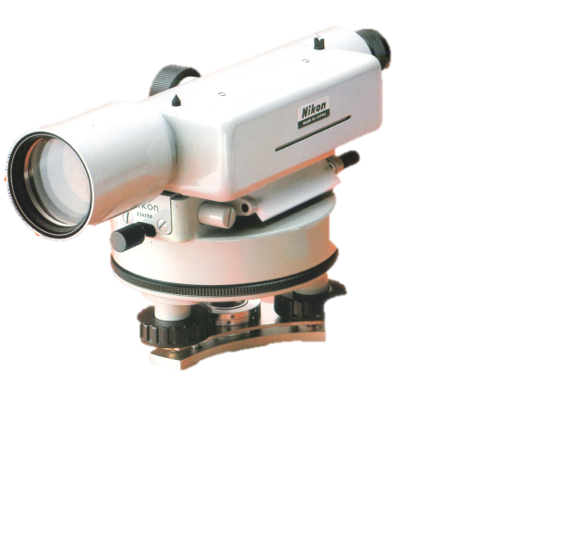

# 3.5.1 ティルティングレベル（微動レベル）2)

　レベルは、主に2点間の高低差や複数地点の地盤高を測定する器機で、スタジア測量などにも用いられる。レベルには、簡易なハンドレベルから、かなり高精度な精密レベルに至るまで多くの種類があり、要求された測量の精度に応じて器機が選択される。近年では、器機を精密に水平に据え付けるだけで自動的に視準線が水平になる自動レベルを用いるケースが多い。ここでは、レベルの構造が比較的単純で視準軸の補正を微動ネジによって補正するティルティングレベル及びハンドレベルについて説明を行う。なおティルティング（Tilt）とは、傾けるという意味であり、傾きを機械側で補正できるためこのように呼ぶ。

> 
>
> 図 3.28　ティルティングレベル（Nikon（ニコン）E5）
