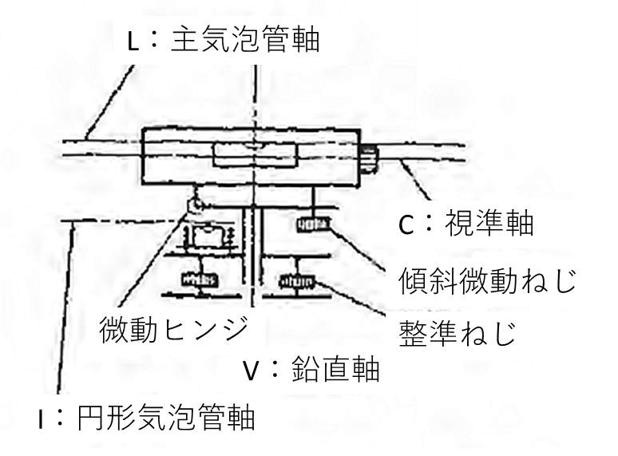
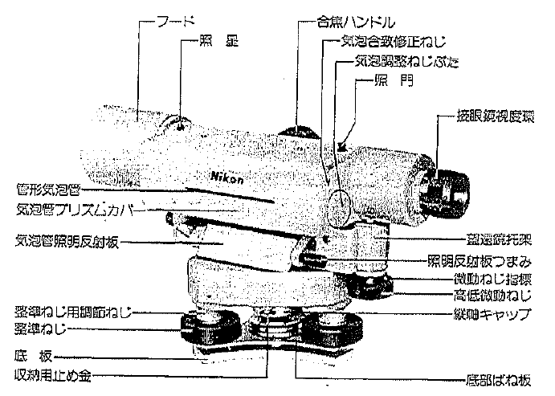
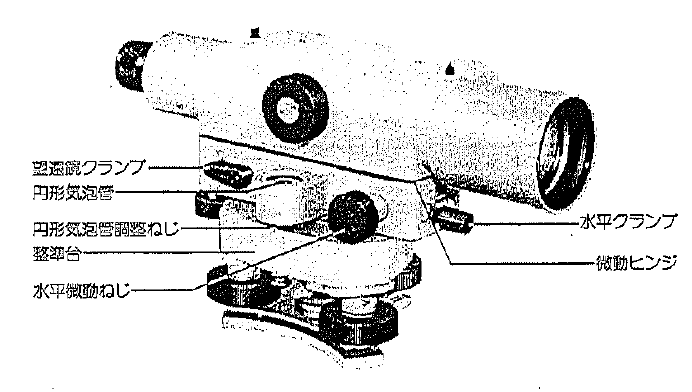
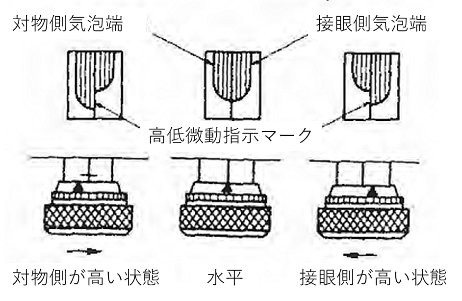

# 3.5.2 ティルティングレベルによる水準測量

ティルティングレベルは、図 3.29図 3.26に示すように望遠鏡と鉛直軸とはヒンジによって接合され、望遠鏡及びこれに付属している主気泡管を鉛直軸に無関係に傾斜微動ネジで傾けることができる構造になっている。従って、整準ネジによって円形水準器の気泡がおおよそ中央にあるようにレベルを据え付ければ、望遠鏡を任意の方向に回したときに視準線が傾いても、その都度微動ネジで主気泡管の気泡を合致するように調整すれば、視準線の高さは常に水平で一定となる。

図 3.29　ティルティングレベルの構造

図 3.30　ティルティングレベルの各部の名称

図 3.31　気泡の合致

1.  
2.  
3.  1.  
    2.  
    3.  
4.  
5.  

レベルの据え付け位置の決定  
　進行方向を考慮して、後視の標尺（スタッフ）から適当な距離で、地盤の堅固な地点を選定する。三脚の設置  
　2本の足を地中に固定した後、他の1本の脚で三脚の頭部が水平になるように調整する。また、レベルの望遠鏡の位置が測定しやすいように三脚の高さを固定する。レベルの整準  
　円形気泡管（丸水平）の気泡を○印の中央に入れるように整準ネジで調整する。以下に、レベルの整準の流れ図を示す。水平クランプをゆるめ、望遠鏡を三本の整準ネジの内の2本と水平になるようにする。望遠鏡と水平の位置の整準ネジにより、気泡を気泡管の中央に移動させる。次にもう一個の整準ネジにより気泡管の〇印の中央に気泡を入れる。望遠鏡をのぞき、望遠鏡内の気泡を合致させ望遠鏡を水平にする。測点上に、標尺を垂直に立てる  
　標尺を正確に据え付け、なおかつ垂直に立てないと、精度の高い結果が期待できない。標尺は、地盤が悪いときには、標尺台または木杭などの上に垂直に立てる。標尺を立てる場合、標尺の側面を両手でしっかりと支え、前面はレベルの方向に正しく向ける。左右の傾きは、標尺に取り付けてある水準器を用いて修正し、さらに測定者は望遠鏡の十字縦線で標尺が垂直になるように標尺を持っている者に指示し、修正を行う。また、前後の傾きは、標尺をゆっくりと前後に傾け標尺の読みが最小になる点を読みとるようにする。レベルで標尺を視準  
　望遠鏡内の十字線と合致した標尺の目盛りを読みとる。
