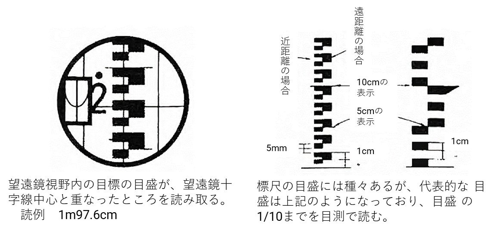
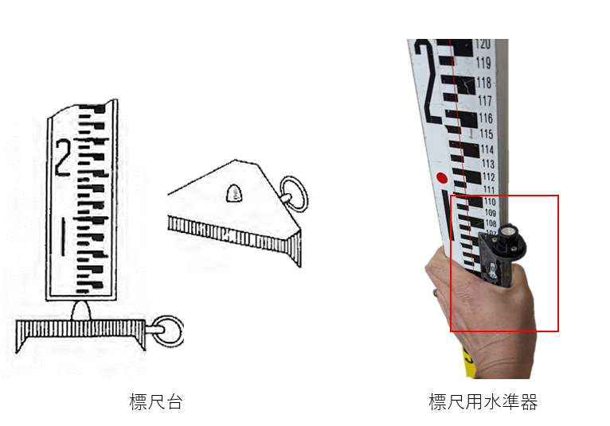

# 3.5.3 標尺

標尺は、測点上に鉛直に立て、レベルによりその目盛りを読み取り、2点間の高低差から測点の地盤高を求めようとするものである。また、標尺台は重要な測点に置き、標尺をそのうえに立てる。標尺のわずかな沈下をも防ぐための器具である。

・標尺の読み方

　標尺の目盛は様々あるが、本実習で用いる代表的なものは、太い目盛が10mm、細い目盛が5mm間隔となっている。この目盛の1/10まで読む。前後の傾きによる高さの誤差は、標尺を前後にゆっくりと傾けていき、最小の高さを読み取るようにすればよい。

> 

図 3.32　標尺の読み方

・標尺の立て方

レベルを正確に据え付けても標尺の立て方が悪いと、高い精度の水準測量は期待できない。要領は、標尺の側面を両手でしつかりと支え、前面はレベルの方向に正しく向け、付属の水準器で鉛直に立てる。水準器のない場合、測定者が標尺の左右の傾きを望遠鏡の十字縦線で標尺が鉛直になるように標尺を持っているものに指示し、修正を行う。地盤が悪いときには、標尺台または木杭などの上に垂直に立てるようにする。

> 
>
> 図 3.33　標尺台と標尺用水準器
