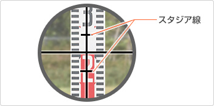
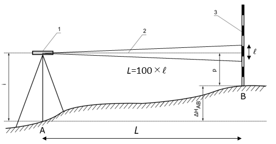

# 3.5.4 ティルティングレベルによるスタジア測量

レベルを用いた水準測量では水準誤差の配分のためおおよその距離を測定するためにスタジア測量を用いる。望遠鏡の焦点板には、スタジア線が上下、左右に焦点距離の1/100の割合で入っている。スタジア線（図 3.34）にはさまれた長さ（$\mathcal{l}$）を測定することにより目標までの概略距離（$L$）を求めることができる（図 3.35）。

図 3.34　スタジア線

> 図 3.35　スタジア測量
