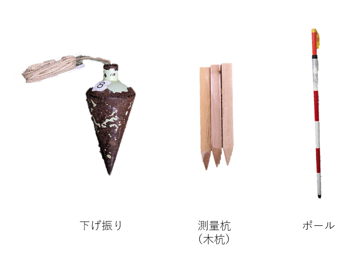

# 3.7 その他の器具

　そのほかに用いる器具を図 3.36に示す。

・下げ振り

下げ振りは、鉛直線の方向、測点上に測量機器を設置するときに用いる。トータルステーションの箱の中に入っているものを利用する。

・測量杭、測量釘

測点の位置を定めるのに用いる。

・ポール

測点を示すとき、測線の方向を決めるとき、測線を延長するとき、または距離・高低を略測するときなどに用いられる。ポールの長さは2~4mで20cmごとに紅白に塗り分けられており、目標として発見しやすいようになっている。

図 3.36　下げ振り、測量杭、ポール
