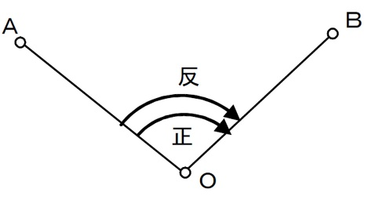
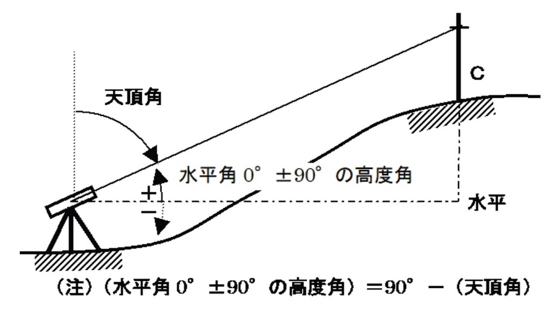
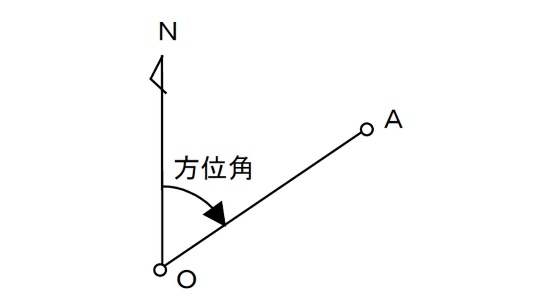

# 4.3.1 外業

## トータルステーションの据え付けと準備

- 
- 
- 
- 
- 

## 各班に与えられた測点Ｏに、トータルステーションを据え付け、整準する。3.4.1 [据え付け（整純と致心）](#据え付け整準と致心)を参照。トータルステーションの固定・微動つまみを確認する。3.3.1 各部の名称を参照。バッテリーを取り付け、電源スイッチを入れる。3.4.2 電源を入れる、[3.4.6 バッテリーの装着・取り外し](#バッテリーの装着取り外し)を参照。ピープサイトを用いて望遠鏡のおおよその向きを決め、水平固定つまみを締め付けて望遠鏡を固定する。3.4.7 望遠鏡のピント合わせとターゲットの視準を参照。接眼レンズと対物レンズの焦点を合わせ（視差の除去）、水平微動つまみを用いて十字縦線をＡ点に一致させる（Ａ点の視準）。3.4.7 望遠鏡のピント合わせとターゲットの視準を参照。単測法による水平角ＡＯＢの測定

- 
- 
- - 
  - 
  - 
  - 
- - 
  - 
  - 
  - 

<!-- -->

- - 

指定されたＡ点とＢ点を視準し、単測法（正反１対回）で水平角∠AOB（図 4.1）を測定する。以下の作業を班員全員が1回ずつ実施する。測定に先立ち、水平角∠AOBがどれくらいの角度になるかを予想する。（a）正位での測定[3.4.8　角度の測定 (1)正位のみの単測法](#section)を参照望遠鏡を正位にする。正位とは、望遠鏡微動つまみ（図 3.3）が手前に来ている状態である。Ａ点を視準して、水平角0°に設定する。Ｂ点を視準して角度を読み取り、野帳に記入する。（b）反位での測定[3.4.8　角度の測定 (2)正反1対回による単測法](#正反1対回による単測法)を参照望遠鏡を180°回転させ、本体を180°回転させて、望遠鏡を反位にする。Ａ点を視準して、水平角0°に設定する。Ｂ点を視準して角度を読み取り、野帳に記入する。測定値の確認正位と反位の測定値の差（較差）の制限値を20秒とする。もし、これを超える較差が出たら、他の測定が全て終了した後、時間があれば再測する。制限値内に収まれば、正位と反位の測定値の平均値（求める水平角）を計算して野帳に記入する。野帳への記入は4.5　野帳：角測量を参照すること。

図 .1　角度の測定

## 倍角法による水平角ＡＯＢの測定

- - - 
    - 
    - 
    - 
    - 
  - - 
    - 
    - 
    - 
    - 
    - 

<!-- -->

- - 

## 指定されたＡ点とＢ点を視準し、倍角法（2倍角）で水平角ＡＯＢを測定する。正位での測定[3.4.8 角度の測定 (3)正位のみの倍角法](#正位のみの倍角法)を参照Ａ点を視準して【OK】を押す。Ｂ点を視準して【OK】を押す。もう一度Ａ点を視準して【OK】を押す。もう一度B点を視準して【OK】を押し、角度を読み取り野帳に記入する。反位での測定[3.4.8 角度の測定 (4)正反1対回による倍角法](#正反1対回による倍角法)を参照望遠鏡を180°回転させ、本体を180°回転させて、望遠鏡を反位にする。Ａ点を視準して【OK】を押す。Ｂ点を視準して【OK】を押す。もう一度Ａ点を視準して【OK】を押す。もう一度B点を視準して【OK】を押し、角度を読み取り野帳に記入する。測定値の確認正位と反位の測定値の差（較差）の制限値を20秒とする。もし、これを超える較差が出たら、他の測定が全て終了した後、時間があれば再測する。制限値内に収まれば、正位と反位の測定値の平均値（求める水平角）を計算して野帳に記入する。野帳への記入は4.5 野帳：角測量を参照。高度角の測定

- 
- - - 
    - 
  - - 
    - 
    - 

<!-- -->

- - 

測定に先立ち、高度角がどれくらいの角度になるかを予想する。指定されたＣ点を視準し、高度角（図 4.2）を測定する。以下の作業を班員全員が1回ずつ実施する。正位での測定C点を視準して天頂角を読み取る。トータルステーションは水平に据え付けてあるので、このとき表示される値が求める天頂角である。天頂角から水平0°±90°の高度角を計算し、天頂角と水平0°±90°の高度角を野帳に記入する。反位での測定望遠鏡を180°回転させ、本体を180°回転させて、望遠鏡を反位にする。C点を視準して天頂角を読み取る。天頂角から水平0°±90°の高度角を計算し、天頂角と水平0°±90°の高度角を野帳に記入する。測定値の確認正位と反位の測定値の差（較差）の制限値を1分とする。もし、これを超える較差が出たら、他の測定が全て終了した後、時間があれば再測する。制限値内に収まれば、正位と反位の測定値の平均値（求める高度角）を計算して野帳に記入する。

図 4.2　天頂角と高度角

## 方位角の概略測定

- 
- 
- 
- 
- 

Ａ点の方位角（図4.3）を測定する。以下の作業を班員全員が1回ずつ実施する。トータルステーションの棒磁石取り付け金具に棒磁石を取り付ける。磁石を見ながら機械を回転させ、おおよそ北向きとして固定する。水平微動つまみで磁石の向きを調整し、トータルステーションの向きを北に合わせ、水平角0°に設定する。Ａ点を視準し、水平角の読みをとって野帳に記入する。磁石の精度は高くないので、丁寧に作業し制限値は設けないとする。

図 4.3　方位角
