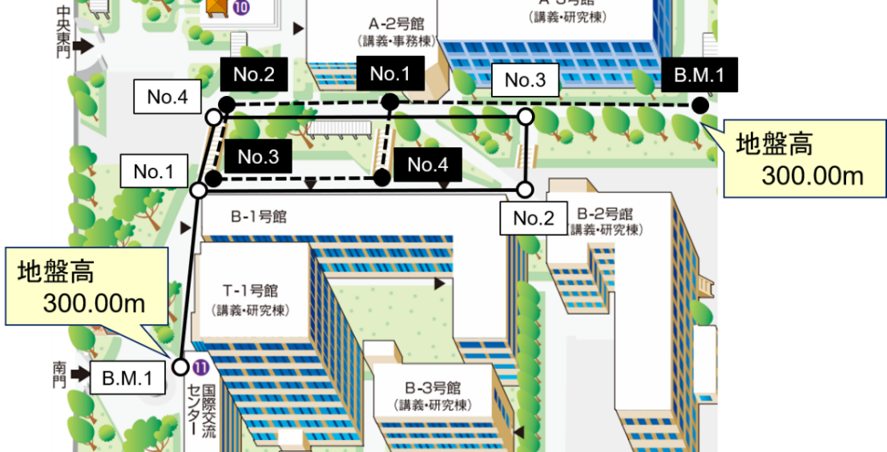

# 6.3.1 作業の概要

図 6.1に示すように大学構内の路線をとり、測点B.M.1（本実習では標高300.000mであると仮定する）を基準として、指定された４点（測点1〜4）の地盤高を4級水準測量によって求める。4級水準測量とは、河川測量における山地部の定期縦断測量等に用いられる測量水準で、往復観測値の較差の許容範囲が20mm√*L*以内（*L*：路線長 (km)）となっている。測定方法は、昇降式とする。昇降式による水準測量では、視準線が示す標尺の読みを取るだけでなく、上下スタジア線が示す標尺の読みも取る。これにより、スタジア測量による後視、前視の視準距離が測定でき、測点間の距離および全路線帳が算出できる。

図 6.1　測量区域（山梨大学工学部構内）と測量路線
