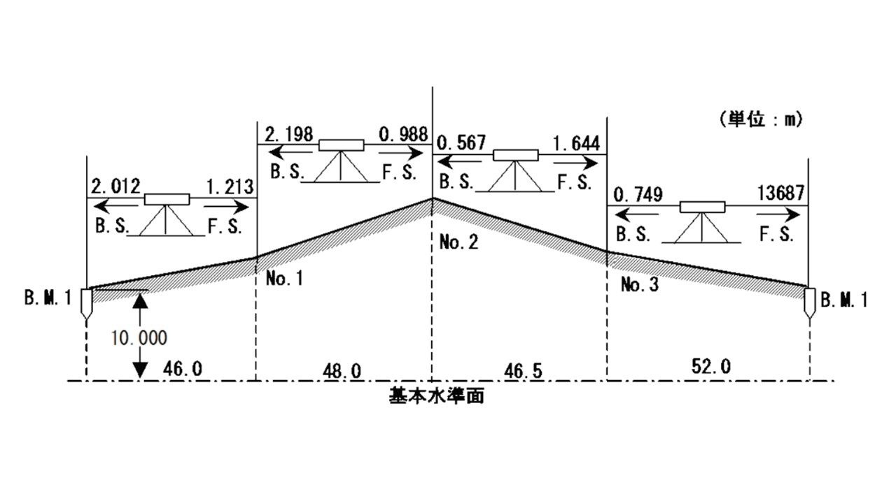
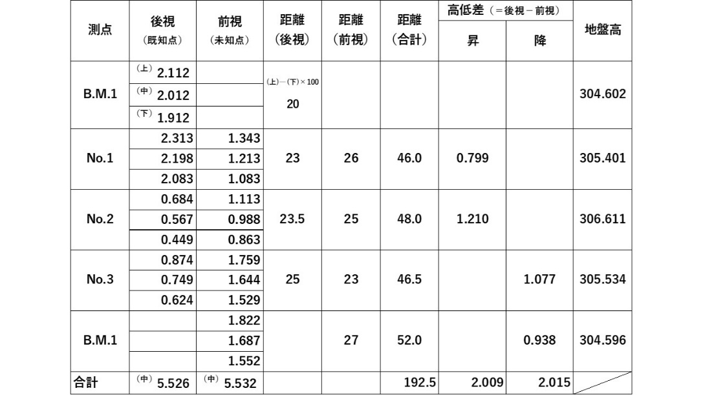

# 6.3.4 内業

## 内業の概要

- 
- 

## 内業では、出発点の地盤高と戻ったときのその点の地盤高の差（水準誤差）を計算し許容値以内であれば、各測点について出発点からの距離に比例した調整量を算出して調整地盤高を計算する。本実習では、昇降式による水準測量の計算例から、内業でのデータ処理方法を解説する。昇降式による水準測量のデータ処理の例

- 

図 6.3のような昇降式による水準測量を行い、得られたデータを野帳に記入すると表 6.1のようになる。

図 6.3　昇降式による水準測量の一例（B.M.1からT.P.1を経てB.M.1に戻るループを一直線で書き変えた図）

表 6.1　昇降式による野帳記入例（単位：m）

- - 

<table>
<colgroup>
<col style="width: 12%" />
<col style="width: 66%" />
<col style="width: 20%" />
</colgroup>
<thead>
<tr class="header">
<th>（a）水準誤差の計算各測点の前視、後視の視準距離を計算し、路線長Lを求める。 
なお、視準距離の計算式は以下の通りである。</th>
<th>視準距離＝（上スタジア-下スタジア）×100</th>
<th>式（6-1）</th>
</tr>
</thead>
<tbody>
</tbody>
</table>

- 

<!-- -->

- - 

<table>
<colgroup>
<col style="width: 12%" />
<col style="width: 66%" />
<col style="width: 20%" />
</colgroup>
<thead>
<tr class="header">
<th>表 6.1　B.M.1の後視の視準距離の例： 
(2.112－1.912)×100=20m（b）許容水準誤差の計算4級水準測量の許容水準誤差を計算する。計算式は以下の通りである。</th>
<th>$許容水準誤差 = 20\sqrt{L}$、<em>L</em>: 路線長 (km)</th>
<th>式（6-2）</th>
</tr>
</thead>
<tbody>
</tbody>
</table>

- 

<!-- -->

- 

<!-- -->

- 

<table>
<colgroup>
<col style="width: 12%" />
<col style="width: 66%" />
<col style="width: 20%" />
</colgroup>
<thead>
<tr class="header">
<th>表 6.1の例 
<em>L</em>＝0.1925 (km)、$20\sqrt{L} = 20\sqrt{0.1925} = 8.77\ $(mm)（単位に注意）（c）水準誤差の計算各測点の高低差を求める。計算式は以下の通りである。なお、高低差が正の値の場合は「昇」、負の値の場合は「降」の欄に記入すること。</th>
<th>高低差＝後視－前視</th>
<th>式（6-3）</th>
</tr>
</thead>
<tbody>
</tbody>
</table>

- 

- 

<table>
<colgroup>
<col style="width: 12%" />
<col style="width: 66%" />
<col style="width: 20%" />
</colgroup>
<thead>
<tr class="header">
<th>表 6.1　B.M.1-No.1の高低差の例 
2.012－1.213＝0.799 (m)水準誤差を求める。計算式は以下の通りである。</th>
<th>水準誤差＝ 
｜高低差「昇」の合計値－高低差「降」の合計値｜</th>
<th>式（6-4）</th>
</tr>
</thead>
<tbody>
</tbody>
</table>

- 

<!-- -->

- - 

  - 

> 表 6.1の例  
> 水準誤差＝｜2.009－2.015｜＝0.006 (m)（d）誤差の確認水準誤差が許容水準誤差に収まっているかを確認する。表 6.1の例：  
> 許容水準誤差（8.77mm） \> 水準誤差（6mm）であるので、測定誤差（水準誤差）は許容される。調整地盤高の配分に進む。許容水準誤差を超えている場合は、外業をやり直す。

- - 

<table>
<colgroup>
<col style="width: 12%" />
<col style="width: 66%" />
<col style="width: 20%" />
</colgroup>
<thead>
<tr class="header">
<th>（e）調整地盤高の配分各測点について 始点からの距離に比例して調整量を計算して誤差を配分する。計算式は以下の通りである。</th>
<th>調整量＝ 
水準誤差×（各測点までの累加距離/全路線長<em>L</em>）</th>
<th>式（6-5）</th>
</tr>
</thead>
<tbody>
</tbody>
</table>

- 

> 計算例：表 6.2の通り
>
> 表 6.2　水準測量の誤差の調整（単位：m）

