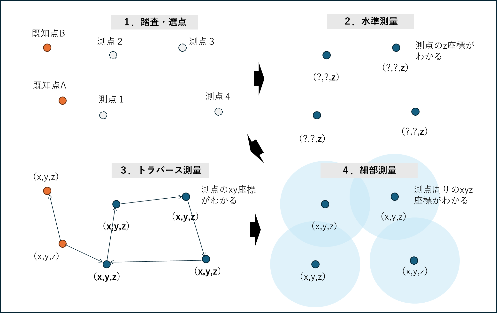

# 7.3 作業全体の流れ

　地形測量の目的である地形図を作成するためには、地形の起伏を面的に把握する必要がある。しかし測量して得られるのは点なので、効率的な方法を考える必要がある。図 7.1は実習の測量手順を概念図で示している。この図に示すように、観測の基準となる測点を設けて、その周りで次々を測量することで、面的な座標値取得を実施する。

１．踏査・選点では、地形起伏を把握したい範囲を囲むように測点を設ける。このとき、測点で囲まれた面積が小さければ、最終的に得られるデータの範囲も狭くなり効率が悪い。測点からの見通しが悪くても同様である。また、すでに座標が得られている点から見通しが取れないと、測点を設定することができない。

次に、既知点の情報を用いて、測点のxyz座標を求める必要がある。２．水準測量では、z座標を得ることができる。３．トラバース測量では、xy座標を得ることができる。これで測点のxyz座標を得ることが可能となる。最後に、４．細部測量において、測点にトータルステーションを据え付け、そこから周りの地形高を次々と測量することで、面的な点データを得ることができる。このデータをもとに等高線を引けば、地形図のベースとなる標高図が完成できる。

図 7.1　地形測量の作業概念図
