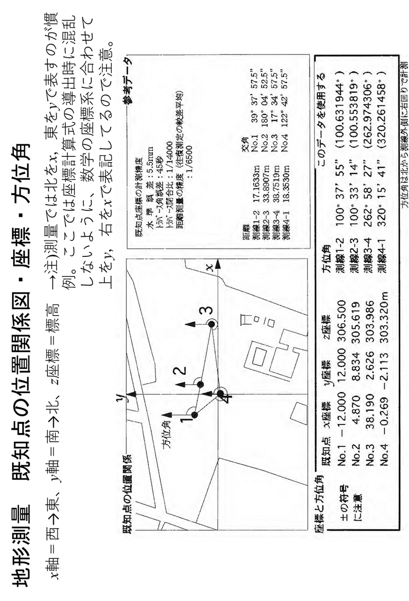
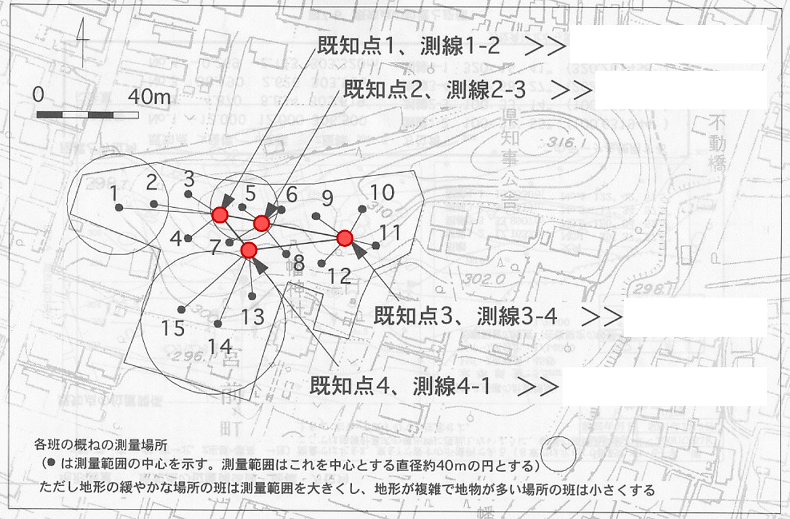

# 7.4 踏査・選点

　以下、踏査・選点における注意事項を示す。

1.  - 
    - 

2.  - 1.  
      2.  
      3.  
      4.  

    <!-- -->

    - 

    <!-- -->

    - 
    - 

作業計画の立案・準備各班の概略の測量範囲を選定する。既知点の情報は図 7.2に、各班の分担は当日に別途指示するが、図 7.3のように各班の担当が領域全体を網羅するように配置する。踏査・測点の選点測点は4点設ける。選点条件は、測点が両隣の測点から視準可能であること。その周りの見通しも確認し、細部測量でもれなく測量が可能か（例えば木の陰になって測量できない場所が多くなりすぎないか）確認する。既知点を測点にすることは禁止とする。等高線に対して斜めの測線となるようにする（図 7.4参照）測点は閉合トラバース（一周回ることのできる配置）にすること測点間距離は最低でも10mとする。測点No.1は既知点が見通せる場所に設ける。測点No.1の座標は、２つの既知点（ここでは仮にA、Bとする）および既知測線A-Bと測点No.lの間で3次元測量を行なって求める。（図 7.5参照）

> 
>
> 図 7.2　既知点の位置と座標
>
> 

図 7.3　各班の測量場所と使用する既知点

> 
>
> 図 7.4　効率の良い閉合トラバースの側線の取り方

3.  - 
    - 
    - 

> 測点の設置木杭を設置する場合、木杭は歩行者の邪魔にならない場所に、抜かれないように十分深く打ち込む。動かない石を利用する場合は、石に白マジックで「班名・測点番号」を記入する。測点番号は「時計回り」につける。設置したら野帳（7.5.2　野帳：測点1の座標及び、測線1-2の方位角の測量）に見取り図を記録する。
