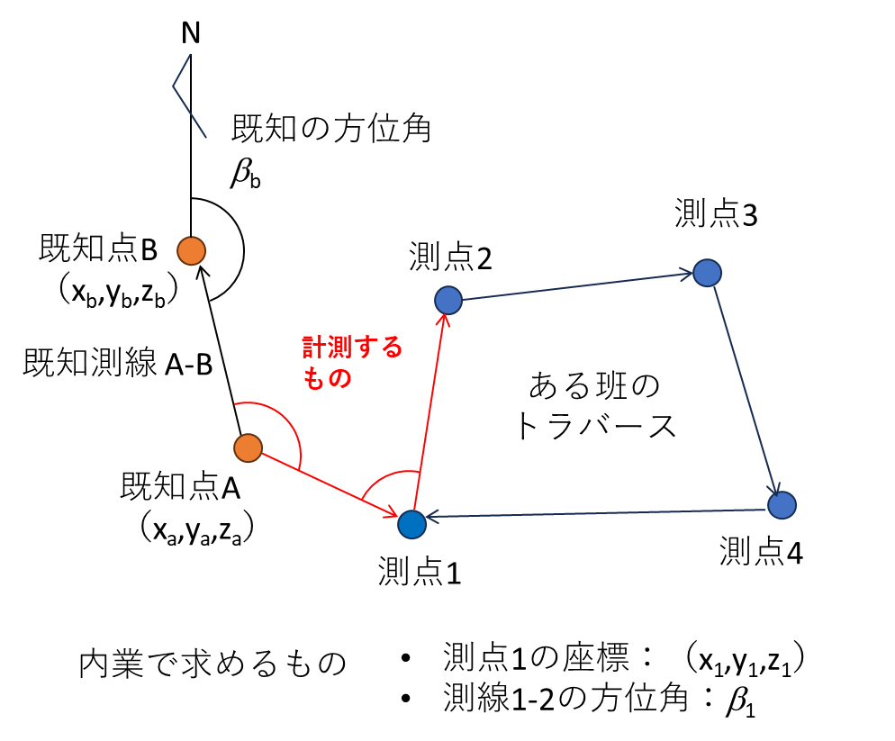

# 7.5.1 作業の流れと注意事項

図 7.5に閉合トラバース測量の一例を示す。測定は、内角は単測法で正反の1回、水平距離は5回の測定値を平均とし、高低差は1回測定する。以下に手順を示す。

1.  
2.  
3.  - 
    - 
4.  
5.  - 
6.  
7.  

略図を描く<u>既知点A</u>にトータルステーンョンを据えつける。既知点Bおよび測点1にプリズムを設置し、既知点B～測点1の内角、および既知点Aと測点1の水平距離を測定する。測定の許容条件は、正反の差20秒以内、水平距離往復差5mm以内。プリズムはできるだけ低く設置する。高く設置すると、プリズムの整準誤差によって距離測定に大きな誤差を生じる危険がある。<u>測点1</u>にトータルステーションを据えつける。既知点A～測点2の内角および既知点Aと測点1の水平距離を測定する。既知点Aと測点1の水平距離は、往復の測定値の平均値とする。<u>既知点Aと測点1の両方を見通せる場所にレベルを据えつけ</u>、既知点Aと測点1の地盤高差を測定する。計測結果を教員に報告し、許容誤差範囲なら測点1～4の水準測量に進む。 

図 7.5　閉合トラバース測量の一例
