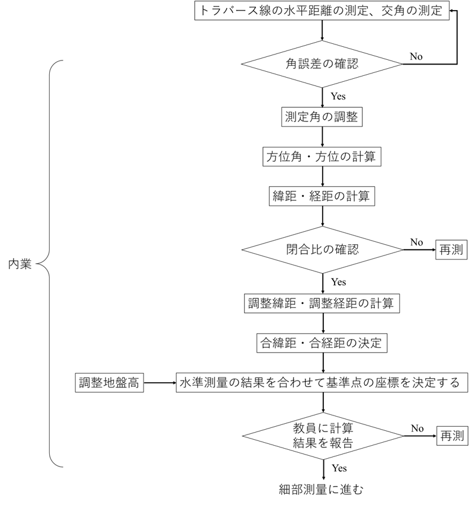

# 7.7.1 作業の流れと注意事項

　トラバース測量とは、測点の平面座標を決定するための測量である。以下の図7.5にフローを示す。

> 図 7.6　トラバース測量のフロー

注意事項は以下の通りである。

1.  
2.  
3.  
4.  
5.  
6.  
7.  
8.  
9.  
10. 

測定項目は、「水平距離」「高低差」である。トータルステーションの測定精度とレベルの測定精度を比較するために「プリズム高」「機械高」も測定する。トラバース線の距離測定は、光波距離計を使って5回以上測定する。精度は平均二乗誤差で±5 mm以内とする。交角の測定は、単測法（正反）を2回、前視から右回りで行う。正反の差は20秒以内、観測角の許容角誤差は60秒$\times \sqrt{n}$ (*n*：測点数）とする。方位角は、既知点の方位角と測定した交角から計算で求める。計算の単位は、角度を秒、距離をmmとし、それ以下の数値を丸める。測定角の調整は、角誤差を各角に均等に配分して行う。許容閉合比は1/1000とする。閉合誤差の調整にはコンパス法則を用いる。データ処理方法は、8.4　Microsoft Excelでの座標の計算を参照すること （8.4　の方法は反時計回りに測点Noが設定されているので注意。時計回りの場合を各自で考えよ。）水準測量・トラバース測量は、班員を分割して同時並行で作業を進めてもよい。ただし、同じ人が同じ作業に偏ることのないよう、作業を交替することを条件とする。
