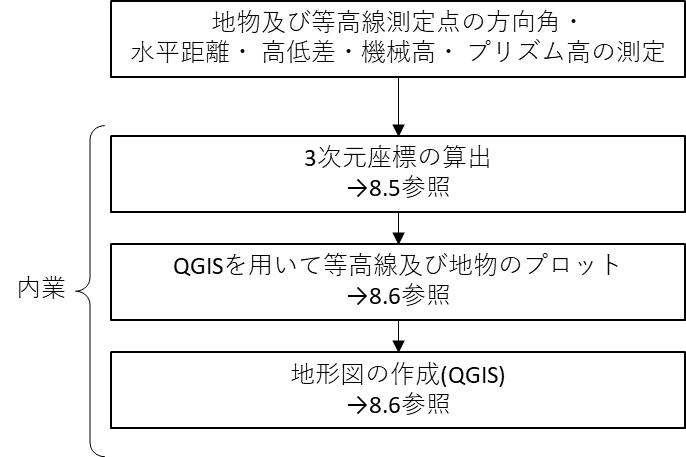
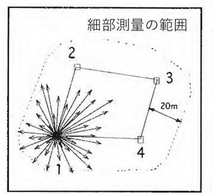
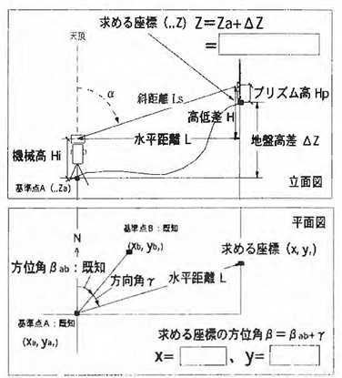
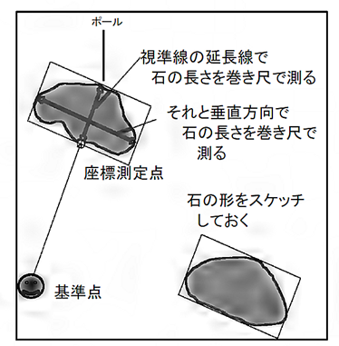
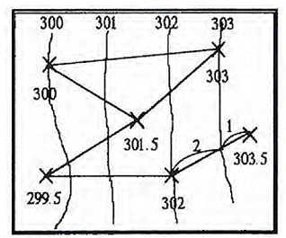

# 7.8.1 作業の流れと注意事項

　細部測量とは、既知となった測点まわりの3次元座標（x, y, z）を得るための測量である。以下の図 7.7にフローを示す。

> 図 7.7　細部測量のフロー

注意事項は以下のとおりである。

1.  

測量範囲は、トラバースの内側全体と外側約15~20mの範囲とする。測点１～４周りでの測定で、網羅的かつ地形の変化点を抑えること（図 7.8）。測定の基本的方法：

2.  
3.  1.  
    2.  
    3.  
    4.  
4.  1.  
    2.  

| 計測データを記録する野帳を準備する。<u>水平距離と高低差</u>は、数回の測定値を見て平均的な値を1つ選ぶ。今回の実習で使用するトータルステーションは、斜距離と天頂角をもとに自動的に水平距離と高低差を計算し表示する機能を持っている。測点と地物の地面 (あるいは等高線測定点)の地盤高差は、図 7.9のように、高低差、機械高、プリズム高から求めることができる。したがって、次の2つの計測値が必要になるので、これを測定する。トータルステーションの「機械高」を測定。各測点に据えつけるごとに巻尺で測定する。「プリズム高」を測定。（3.3.5　プリズム参照）。基本的に高さを変えずできるだけ低く設置する。高く設置すると、プリズムを取り付けるポールの整準誤差によって距離測定に大きな誤差を生じる可能性が高まる。<u>方位角</u>を方向角と測線の方位角から求める。方向角は、前視側のトラバース線から右回りで測定する。この測り方を統一すること。この測り方を統一しておかないと、あとの計算が面倒になる。方向角の測定は「単測法、正のみ1回」で測定すればよい 。誤差を防ぐため5点程度を連続して測ったら、既知点をもう一度視準し、0度であることを確認する。 |  |
|---------------------------------------------------------------------------------------------------------------------------------------------------------------------------------------------------------------------------------------------------------------------------------------------------------------------------------------------------------------------------------------------------------------------------------------------------------------------------------------------------------------------------------------------------------------------------------------------------------------------------------------------------------------------------------------------------------------------------------------------------------------------------------------------------------------------------------------------------------------------------------------------------------------------------------------------------------------------------------------------------------------------------------------------------------------------------------------------------------------------------------------------------------|-----------------------------------------------------------------------------------------------------------|
| 図 7.8　細部測量 (=地形図作成)の範囲                                                                                                                                                                                                                                                                                                                                                                                                                                                                                                                                                                                                                                                                                                                                                                                                                                                                                                                                                                                                                                                                                                                    | 図 7.9　細部測量の計測要素                                                                                |

測定対象：

1.  - 
    - 
    - 
2.  - 
    - 
3.  

等高線測定点の測量細部測量計測範囲に均一に分散するようにする。目測で地形形状が単調な所は粗に複雑なところは密に測る。測点から10点程度測れば十分。地物の測定データも等高線測定点のデータに利用してよい。石の上を測定点にした場合は、測定点から地面までの高さを測っておけば、等高線の測定点として使うことができる。地物の測量大きな石、人工建造物 (石碑、建物、遊具、フェンスなど)、道 (草の生えていないところ)とする場所。樹木と小さな石の測定は不要。 大きな石の概略の形を計測する。図 7.10に方法を示す。座標計算はエクセルを使って計算し（8.4　Microsoft Excelでの座標の計算参照）そのデータをQGISにインポートして間接法（図 7.11）による等高線作成を行う。

<table>
<colgroup>
<col style="width: 50%" />
<col style="width: 49%" />
</colgroup>
<thead>
<tr class="header">
<th></th>
<th><blockquote>

</blockquote></th>
</tr>
</thead>
<tbody>
<tr class="odd">
<td><blockquote>

図 7.10　大きな石の測り方

</blockquote></td>
<td><blockquote>

図 7.11　等高線作成における間接法の概念図

</blockquote></td>
</tr>
</tbody>
</table>
