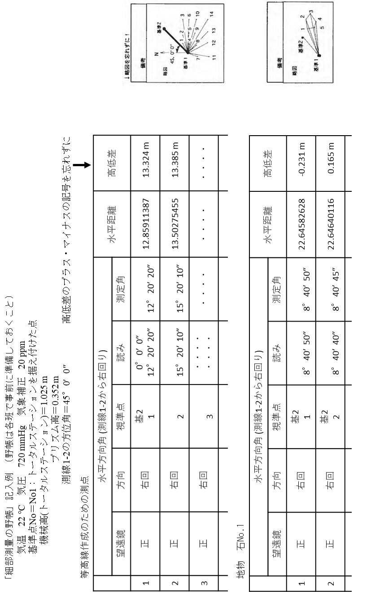

# 7.10 野帳：細部測量

年月日： 　　　　天気：　　　　班：　　　　測定者：　　　　記帳者：　　　　

気温：　　　　（°C）気圧：　　　　（hPa）気象補正係数：　　　　（ppm）

測点：［　　　　］　（TSを据え付けた測点）

機械高：［　　　　］　機械高：［　　　　］　プリズム高：［　　　　］　

測点［　　　　］から［　　　　］への方位角：［　　　　　　　　］

対象［　　　　］　水平方向角：測線［　　　　　　　　］から右回り

<table>
<colgroup>
<col style="width: 5%" />
<col style="width: 13%" />
<col style="width: 13%" />
<col style="width: 13%" />
<col style="width: 13%" />
<col style="width: 13%" />
<col style="width: 13%" />
<col style="width: 13%" />
</colgroup>
<thead>
<tr class="header">
<th>#</th>
<th>望遠鏡</th>
<th>方向</th>
<th>視準点</th>
<th>
読み

（°′″）
</th>
<th>
測定角

（°′″）
</th>
<th>
水平距離

（m）
</th>
<th>
高低差

（m）
</th>
</tr>
</thead>
<tbody>
<tr class="odd">
<td rowspan="2"></td>
<td rowspan="2">正</td>
<td rowspan="2">右回</td>
<td></td>
<td></td>
<td rowspan="2"></td>
<td rowspan="2"></td>
<td rowspan="2"></td>
</tr>
<tr class="even">
<td></td>
<td></td>
</tr>
<tr class="odd">
<td rowspan="2"></td>
<td rowspan="2">正</td>
<td rowspan="2">右回</td>
<td></td>
<td></td>
<td rowspan="2"></td>
<td rowspan="2"></td>
<td rowspan="2"></td>
</tr>
<tr class="even">
<td></td>
<td></td>
</tr>
<tr class="odd">
<td rowspan="2"></td>
<td rowspan="2">正</td>
<td rowspan="2">右回</td>
<td></td>
<td></td>
<td rowspan="2"></td>
<td rowspan="2"></td>
<td rowspan="2"></td>
</tr>
<tr class="even">
<td></td>
<td></td>
</tr>
<tr class="odd">
<td rowspan="2"></td>
<td rowspan="2">正</td>
<td rowspan="2">右回</td>
<td></td>
<td></td>
<td rowspan="2"></td>
<td rowspan="2"></td>
<td rowspan="2"></td>
</tr>
<tr class="even">
<td></td>
<td></td>
</tr>
<tr class="odd">
<td rowspan="2"></td>
<td rowspan="2">正</td>
<td rowspan="2">右回</td>
<td></td>
<td></td>
<td rowspan="2"></td>
<td rowspan="2"></td>
<td rowspan="2"></td>
</tr>
<tr class="even">
<td></td>
<td></td>
</tr>
<tr class="odd">
<td rowspan="2"></td>
<td rowspan="2">正</td>
<td rowspan="2">右回</td>
<td></td>
<td></td>
<td rowspan="2"></td>
<td rowspan="2"></td>
<td rowspan="2"></td>
</tr>
<tr class="even">
<td></td>
<td></td>
</tr>
<tr class="odd">
<td rowspan="2"></td>
<td rowspan="2">正</td>
<td rowspan="2">右回</td>
<td></td>
<td></td>
<td rowspan="2"></td>
<td rowspan="2"></td>
<td rowspan="2"></td>
</tr>
<tr class="even">
<td></td>
<td></td>
</tr>
<tr class="odd">
<td rowspan="2"></td>
<td rowspan="2">正</td>
<td rowspan="2">右回</td>
<td></td>
<td></td>
<td rowspan="2"></td>
<td rowspan="2"></td>
<td rowspan="2"></td>
</tr>
<tr class="even">
<td></td>
<td></td>
</tr>
<tr class="odd">
<td rowspan="2"></td>
<td rowspan="2">正</td>
<td rowspan="2">右回</td>
<td></td>
<td></td>
<td rowspan="2"></td>
<td rowspan="2"></td>
<td rowspan="2"></td>
</tr>
<tr class="even">
<td></td>
<td></td>
</tr>
<tr class="odd">
<td rowspan="2"></td>
<td rowspan="2">正</td>
<td rowspan="2">右回</td>
<td></td>
<td></td>
<td rowspan="2"></td>
<td rowspan="2"></td>
<td rowspan="2"></td>
</tr>
<tr class="even">
<td></td>
<td></td>
</tr>
<tr class="odd">
<td rowspan="2"></td>
<td rowspan="2">正</td>
<td rowspan="2">右回</td>
<td></td>
<td></td>
<td rowspan="2"></td>
<td rowspan="2"></td>
<td rowspan="2"></td>
</tr>
<tr class="even">
<td></td>
<td></td>
</tr>
<tr class="odd">
<td rowspan="2"></td>
<td rowspan="2">正</td>
<td rowspan="2">右回</td>
<td></td>
<td></td>
<td rowspan="2"></td>
<td rowspan="2"></td>
<td rowspan="2"></td>
</tr>
<tr class="even">
<td></td>
<td></td>
</tr>
<tr class="odd">
<td rowspan="2"></td>
<td rowspan="2">正</td>
<td rowspan="2">右回</td>
<td></td>
<td></td>
<td rowspan="2"></td>
<td rowspan="2"></td>
<td rowspan="2"></td>
</tr>
<tr class="even">
<td></td>
<td></td>
</tr>
</tbody>
</table>

細部測量

| 概略図 |
|--------|

野帳の記入例

**  
**

細部測量

年月日： 　　　　天気：　　　　班：　　　　測定者：　　　　記帳者：　　　　

気温：　　　　（°C）気圧：　　　　（hPa）気象補正係数：　　　　（ppm）

測点：［　　　　］　（TSを据え付けた測点）

機械高：［　　　　］　機械高：［　　　　］　プリズム高：［　　　　］　

測点［　　　　］から［　　　　］への方位角：［　　　　　　　　］

対象［　　　　］　水平方向角：測線［　　　　　　　　］から右回り

<table>
<colgroup>
<col style="width: 5%" />
<col style="width: 13%" />
<col style="width: 13%" />
<col style="width: 13%" />
<col style="width: 13%" />
<col style="width: 13%" />
<col style="width: 13%" />
<col style="width: 13%" />
</colgroup>
<thead>
<tr class="header">
<th>#</th>
<th>望遠鏡</th>
<th>方向</th>
<th>視準点</th>
<th>
読み

（°′″）
</th>
<th>
測定角

（°′″）
</th>
<th>
水平距離

（m）
</th>
<th>
高低差

（m）
</th>
</tr>
</thead>
<tbody>
<tr class="odd">
<td rowspan="2"></td>
<td rowspan="2">正</td>
<td rowspan="2">右回</td>
<td></td>
<td></td>
<td rowspan="2"></td>
<td rowspan="2"></td>
<td rowspan="2"></td>
</tr>
<tr class="even">
<td></td>
<td></td>
</tr>
<tr class="odd">
<td rowspan="2"></td>
<td rowspan="2">正</td>
<td rowspan="2">右回</td>
<td></td>
<td></td>
<td rowspan="2"></td>
<td rowspan="2"></td>
<td rowspan="2"></td>
</tr>
<tr class="even">
<td></td>
<td></td>
</tr>
<tr class="odd">
<td rowspan="2"></td>
<td rowspan="2">正</td>
<td rowspan="2">右回</td>
<td></td>
<td></td>
<td rowspan="2"></td>
<td rowspan="2"></td>
<td rowspan="2"></td>
</tr>
<tr class="even">
<td></td>
<td></td>
</tr>
<tr class="odd">
<td rowspan="2"></td>
<td rowspan="2">正</td>
<td rowspan="2">右回</td>
<td></td>
<td></td>
<td rowspan="2"></td>
<td rowspan="2"></td>
<td rowspan="2"></td>
</tr>
<tr class="even">
<td></td>
<td></td>
</tr>
<tr class="odd">
<td rowspan="2"></td>
<td rowspan="2">正</td>
<td rowspan="2">右回</td>
<td></td>
<td></td>
<td rowspan="2"></td>
<td rowspan="2"></td>
<td rowspan="2"></td>
</tr>
<tr class="even">
<td></td>
<td></td>
</tr>
<tr class="odd">
<td rowspan="2"></td>
<td rowspan="2">正</td>
<td rowspan="2">右回</td>
<td></td>
<td></td>
<td rowspan="2"></td>
<td rowspan="2"></td>
<td rowspan="2"></td>
</tr>
<tr class="even">
<td></td>
<td></td>
</tr>
<tr class="odd">
<td rowspan="2"></td>
<td rowspan="2">正</td>
<td rowspan="2">右回</td>
<td></td>
<td></td>
<td rowspan="2"></td>
<td rowspan="2"></td>
<td rowspan="2"></td>
</tr>
<tr class="even">
<td></td>
<td></td>
</tr>
<tr class="odd">
<td rowspan="2"></td>
<td rowspan="2">正</td>
<td rowspan="2">右回</td>
<td></td>
<td></td>
<td rowspan="2"></td>
<td rowspan="2"></td>
<td rowspan="2"></td>
</tr>
<tr class="even">
<td></td>
<td></td>
</tr>
<tr class="odd">
<td rowspan="2"></td>
<td rowspan="2">正</td>
<td rowspan="2">右回</td>
<td></td>
<td></td>
<td rowspan="2"></td>
<td rowspan="2"></td>
<td rowspan="2"></td>
</tr>
<tr class="even">
<td></td>
<td></td>
</tr>
<tr class="odd">
<td rowspan="2"></td>
<td rowspan="2">正</td>
<td rowspan="2">右回</td>
<td></td>
<td></td>
<td rowspan="2"></td>
<td rowspan="2"></td>
<td rowspan="2"></td>
</tr>
<tr class="even">
<td></td>
<td></td>
</tr>
<tr class="odd">
<td rowspan="2"></td>
<td rowspan="2">正</td>
<td rowspan="2">右回</td>
<td></td>
<td></td>
<td rowspan="2"></td>
<td rowspan="2"></td>
<td rowspan="2"></td>
</tr>
<tr class="even">
<td></td>
<td></td>
</tr>
<tr class="odd">
<td rowspan="2"></td>
<td rowspan="2">正</td>
<td rowspan="2">右回</td>
<td></td>
<td></td>
<td rowspan="2"></td>
<td rowspan="2"></td>
<td rowspan="2"></td>
</tr>
<tr class="even">
<td></td>
<td></td>
</tr>
<tr class="odd">
<td rowspan="2"></td>
<td rowspan="2">正</td>
<td rowspan="2">右回</td>
<td></td>
<td></td>
<td rowspan="2"></td>
<td rowspan="2"></td>
<td rowspan="2"></td>
</tr>
<tr class="even">
<td></td>
<td></td>
</tr>
</tbody>
</table>

細部測量

| 概略図 |
|--------|

細部測量

年月日： 　　　　天気：　　　　班：　　　　測定者：　　　　記帳者：　　　　

気温：　　　　（°C）気圧：　　　　（hPa）気象補正係数：　　　　（ppm）

測点：［　　　　］　（TSを据え付けた測点）

機械高：［　　　　］　機械高：［　　　　］　プリズム高：［　　　　］　

測点［　　　　］から［　　　　］への方位角：［　　　　　　　　］

対象［　　　　］　水平方向角：測線［　　　　　　　　］から右回り

<table style="width:100%;">
<colgroup>
<col style="width: 5%" />
<col style="width: 12%" />
<col style="width: 12%" />
<col style="width: 12%" />
<col style="width: 15%" />
<col style="width: 15%" />
<col style="width: 13%" />
<col style="width: 13%" />
</colgroup>
<thead>
<tr class="header">
<th>#</th>
<th>望遠鏡</th>
<th>方向</th>
<th>視準点</th>
<th>
読み

（°′″）
</th>
<th>
測定角

（°′″）
</th>
<th>
水平距離

（m）
</th>
<th>
高低差

（m）
</th>
</tr>
</thead>
<tbody>
<tr class="odd">
<td rowspan="2"></td>
<td rowspan="2">正</td>
<td rowspan="2">右回</td>
<td></td>
<td></td>
<td rowspan="2"></td>
<td rowspan="2"></td>
<td rowspan="2"></td>
</tr>
<tr class="even">
<td></td>
<td></td>
</tr>
<tr class="odd">
<td rowspan="2"></td>
<td rowspan="2">正</td>
<td rowspan="2">右回</td>
<td></td>
<td></td>
<td rowspan="2"></td>
<td rowspan="2"></td>
<td rowspan="2"></td>
</tr>
<tr class="even">
<td></td>
<td></td>
</tr>
<tr class="odd">
<td rowspan="2"></td>
<td rowspan="2">正</td>
<td rowspan="2">右回</td>
<td></td>
<td></td>
<td rowspan="2"></td>
<td rowspan="2"></td>
<td rowspan="2"></td>
</tr>
<tr class="even">
<td></td>
<td></td>
</tr>
<tr class="odd">
<td rowspan="2"></td>
<td rowspan="2">正</td>
<td rowspan="2">右回</td>
<td></td>
<td></td>
<td rowspan="2"></td>
<td rowspan="2"></td>
<td rowspan="2"></td>
</tr>
<tr class="even">
<td></td>
<td></td>
</tr>
<tr class="odd">
<td rowspan="2"></td>
<td rowspan="2">正</td>
<td rowspan="2">右回</td>
<td></td>
<td></td>
<td rowspan="2"></td>
<td rowspan="2"></td>
<td rowspan="2"></td>
</tr>
<tr class="even">
<td></td>
<td></td>
</tr>
<tr class="odd">
<td rowspan="2"></td>
<td rowspan="2">正</td>
<td rowspan="2">右回</td>
<td></td>
<td></td>
<td rowspan="2"></td>
<td rowspan="2"></td>
<td rowspan="2"></td>
</tr>
<tr class="even">
<td></td>
<td></td>
</tr>
<tr class="odd">
<td rowspan="2"></td>
<td rowspan="2">正</td>
<td rowspan="2">右回</td>
<td></td>
<td></td>
<td rowspan="2"></td>
<td rowspan="2"></td>
<td rowspan="2"></td>
</tr>
<tr class="even">
<td></td>
<td></td>
</tr>
<tr class="odd">
<td rowspan="2"></td>
<td rowspan="2">正</td>
<td rowspan="2">右回</td>
<td></td>
<td></td>
<td rowspan="2"></td>
<td rowspan="2"></td>
<td rowspan="2"></td>
</tr>
<tr class="even">
<td></td>
<td></td>
</tr>
<tr class="odd">
<td rowspan="2"></td>
<td rowspan="2">正</td>
<td rowspan="2">右回</td>
<td></td>
<td></td>
<td rowspan="2"></td>
<td rowspan="2"></td>
<td rowspan="2"></td>
</tr>
<tr class="even">
<td></td>
<td></td>
</tr>
<tr class="odd">
<td rowspan="2"></td>
<td rowspan="2">正</td>
<td rowspan="2">右回</td>
<td></td>
<td></td>
<td rowspan="2"></td>
<td rowspan="2"></td>
<td rowspan="2"></td>
</tr>
<tr class="even">
<td></td>
<td></td>
</tr>
<tr class="odd">
<td rowspan="2"></td>
<td rowspan="2">正</td>
<td rowspan="2">右回</td>
<td></td>
<td></td>
<td rowspan="2"></td>
<td rowspan="2"></td>
<td rowspan="2"></td>
</tr>
<tr class="even">
<td></td>
<td></td>
</tr>
<tr class="odd">
<td rowspan="2"></td>
<td rowspan="2">正</td>
<td rowspan="2">右回</td>
<td></td>
<td></td>
<td rowspan="2"></td>
<td rowspan="2"></td>
<td rowspan="2"></td>
</tr>
<tr class="even">
<td></td>
<td></td>
</tr>
<tr class="odd">
<td rowspan="2"></td>
<td rowspan="2">正</td>
<td rowspan="2">右回</td>
<td></td>
<td></td>
<td rowspan="2"></td>
<td rowspan="2"></td>
<td rowspan="2"></td>
</tr>
<tr class="even">
<td></td>
<td></td>
</tr>
</tbody>
</table>

細部測量

| 概略図 |
|--------|

細部測量

年月日： 　　　　天気：　　　　班：　　　　測定者：　　　　記帳者：　　　　

気温：　　　　（°C）気圧：　　　　（hPa）気象補正係数：　　　　（ppm）

測点：［　　　　］　（TSを据え付けた測点）

機械高：［　　　　］　機械高：［　　　　］　プリズム高：［　　　　］　

測点［　　　　］から［　　　　］への方位角：［　　　　　　　　］

対象［　　　　］　水平方向角：測線［　　　　　　　　］から右回り

<table style="width:100%;">
<colgroup>
<col style="width: 5%" />
<col style="width: 12%" />
<col style="width: 12%" />
<col style="width: 12%" />
<col style="width: 15%" />
<col style="width: 15%" />
<col style="width: 13%" />
<col style="width: 13%" />
</colgroup>
<thead>
<tr class="header">
<th>#</th>
<th>望遠鏡</th>
<th>方向</th>
<th>視準点</th>
<th>
読み

（°′″）
</th>
<th>
測定角

（°′″）
</th>
<th>
水平距離

（m）
</th>
<th>
高低差

（m）
</th>
</tr>
</thead>
<tbody>
<tr class="odd">
<td rowspan="2"></td>
<td rowspan="2">正</td>
<td rowspan="2">右回</td>
<td></td>
<td></td>
<td rowspan="2"></td>
<td rowspan="2"></td>
<td rowspan="2"></td>
</tr>
<tr class="even">
<td></td>
<td></td>
</tr>
<tr class="odd">
<td rowspan="2"></td>
<td rowspan="2">正</td>
<td rowspan="2">右回</td>
<td></td>
<td></td>
<td rowspan="2"></td>
<td rowspan="2"></td>
<td rowspan="2"></td>
</tr>
<tr class="even">
<td></td>
<td></td>
</tr>
<tr class="odd">
<td rowspan="2"></td>
<td rowspan="2">正</td>
<td rowspan="2">右回</td>
<td></td>
<td></td>
<td rowspan="2"></td>
<td rowspan="2"></td>
<td rowspan="2"></td>
</tr>
<tr class="even">
<td></td>
<td></td>
</tr>
<tr class="odd">
<td rowspan="2"></td>
<td rowspan="2">正</td>
<td rowspan="2">右回</td>
<td></td>
<td></td>
<td rowspan="2"></td>
<td rowspan="2"></td>
<td rowspan="2"></td>
</tr>
<tr class="even">
<td></td>
<td></td>
</tr>
<tr class="odd">
<td rowspan="2"></td>
<td rowspan="2">正</td>
<td rowspan="2">右回</td>
<td></td>
<td></td>
<td rowspan="2"></td>
<td rowspan="2"></td>
<td rowspan="2"></td>
</tr>
<tr class="even">
<td></td>
<td></td>
</tr>
<tr class="odd">
<td rowspan="2"></td>
<td rowspan="2">正</td>
<td rowspan="2">右回</td>
<td></td>
<td></td>
<td rowspan="2"></td>
<td rowspan="2"></td>
<td rowspan="2"></td>
</tr>
<tr class="even">
<td></td>
<td></td>
</tr>
<tr class="odd">
<td rowspan="2"></td>
<td rowspan="2">正</td>
<td rowspan="2">右回</td>
<td></td>
<td></td>
<td rowspan="2"></td>
<td rowspan="2"></td>
<td rowspan="2"></td>
</tr>
<tr class="even">
<td></td>
<td></td>
</tr>
<tr class="odd">
<td rowspan="2"></td>
<td rowspan="2">正</td>
<td rowspan="2">右回</td>
<td></td>
<td></td>
<td rowspan="2"></td>
<td rowspan="2"></td>
<td rowspan="2"></td>
</tr>
<tr class="even">
<td></td>
<td></td>
</tr>
<tr class="odd">
<td rowspan="2"></td>
<td rowspan="2">正</td>
<td rowspan="2">右回</td>
<td></td>
<td></td>
<td rowspan="2"></td>
<td rowspan="2"></td>
<td rowspan="2"></td>
</tr>
<tr class="even">
<td></td>
<td></td>
</tr>
<tr class="odd">
<td rowspan="2"></td>
<td rowspan="2">正</td>
<td rowspan="2">右回</td>
<td></td>
<td></td>
<td rowspan="2"></td>
<td rowspan="2"></td>
<td rowspan="2"></td>
</tr>
<tr class="even">
<td></td>
<td></td>
</tr>
<tr class="odd">
<td rowspan="2"></td>
<td rowspan="2">正</td>
<td rowspan="2">右回</td>
<td></td>
<td></td>
<td rowspan="2"></td>
<td rowspan="2"></td>
<td rowspan="2"></td>
</tr>
<tr class="even">
<td></td>
<td></td>
</tr>
<tr class="odd">
<td rowspan="2"></td>
<td rowspan="2">正</td>
<td rowspan="2">右回</td>
<td></td>
<td></td>
<td rowspan="2"></td>
<td rowspan="2"></td>
<td rowspan="2"></td>
</tr>
<tr class="even">
<td></td>
<td></td>
</tr>
<tr class="odd">
<td rowspan="2"></td>
<td rowspan="2">正</td>
<td rowspan="2">右回</td>
<td></td>
<td></td>
<td rowspan="2"></td>
<td rowspan="2"></td>
<td rowspan="2"></td>
</tr>
<tr class="even">
<td></td>
<td></td>
</tr>
</tbody>
</table>

細部測量

<table>
<colgroup>
<col style="width: 100%" />
</colgroup>
<thead>
<tr class="header">
<th><blockquote>

概略図

</blockquote></th>
</tr>
</thead>
<tbody>
</tbody>
</table>
