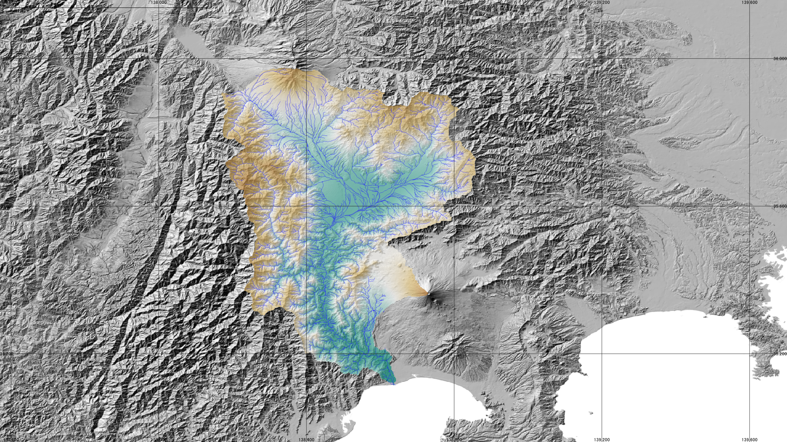

# 8.2 GISとは

GISとはGeographic Information System（地理情報システム）の略称であり、地形や建物、道路などを表す位置情報を持った様々なデータを重ね合わせて様々な分析・表示を行うプログラムである。例えば図 8.1は、陰影起伏図（国土地理院データ）の上に、富士川流域の標高（ラスタデータ）と流路網（ベクタデータ、線）を重ねて表示している。地形図の作成にあたっては、フリーソフトのQGISを各自のパソコンにインストールして使用する（1.6　準備　参照）。

図 8.1　QGISでデータを重ねて表示した例
