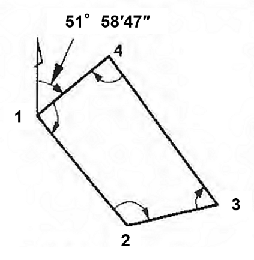
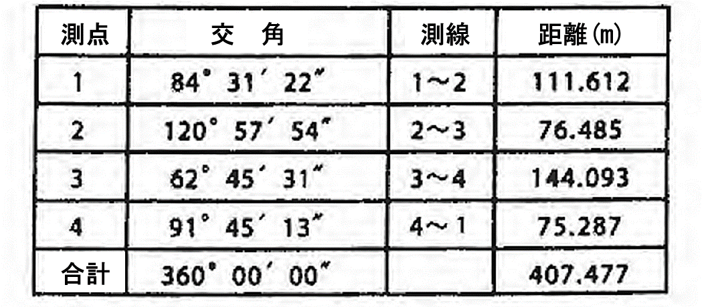
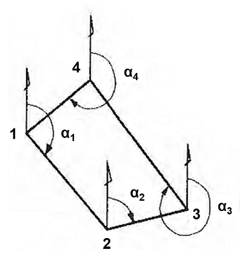
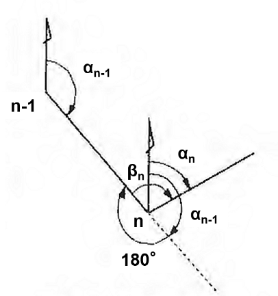
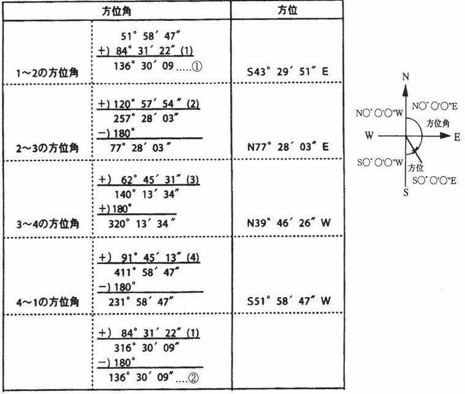
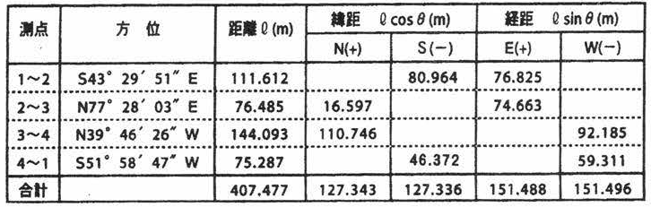
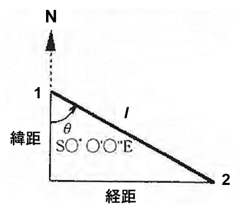
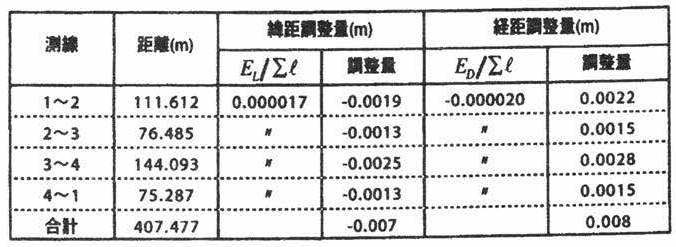
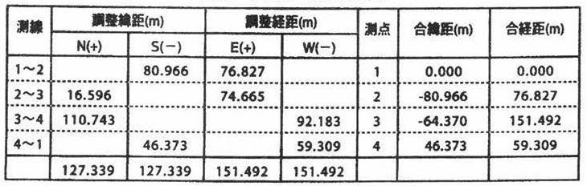
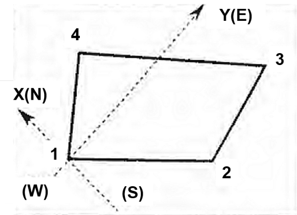

# 8.4.2 トラバース測量データ処理

## 実測データ

　図 8.2のような閉合トラバースにおいて表 8.4のような実測データが得られたものとする。なお、表 8.4の測線の距離は平均値を表す。

> 図 8.2　トラバース
>
> 表 8.4　測定結果

## 角誤差の配分

　表 8.4の角誤差が許容誤差（60″$\sqrt{n}$（n：測線数））の範囲ならば誤差配分をする。許容範囲より大きければ再測する。各誤差の配分方法は、各角に等配分するものとする。端数がでたときには、(3)に示す方法にしたがって方位角を計算し、方位角が45°、135°、225°、315°に近い角に端数をまとめて配分する。

## 方位角・方位の計算

　図 8.3に示すような方位角は式（8-1）によって求められる（図 8.4）。

|     | $$\alpha_{n} = \alpha_{n - 1} + \beta_{n} + 180{^\circ}$$ | 式（8-1） |
|-----|-----------------------------------------------------------|-----------|

ここに

<table>
<colgroup>
<col style="width: 12%" />
<col style="width: 66%" />
<col style="width: 20%" />
</colgroup>
<thead>
<tr class="header">
<th></th>
<th>
αn：求める測線の方位角

αn-1：求める測線の一つ前の測線の方位角

βn：測点の交角
</th>
<th></th>
</tr>
</thead>
<tbody>
</tbody>
</table>

である。なお、方位角が360°を越えたら360°を引いて方位角とする。

　方位角および方位の計算は、表 8.5のように整理することができる。トラバース線に沿って方位角を順次計算し、一周したところで最初の測線の方位角と一致することを確認する（表 8.5 ①と②）。

<table>
<colgroup>
<col style="width: 49%" />
<col style="width: 50%" />
</colgroup>
<thead>
<tr class="header">
<th></th>
<th></th>
</tr>
</thead>
<tbody>
<tr class="odd">
<td>図 8.3　方位角</td>
<td><blockquote>

図 8.4　方位角の計算

</blockquote></td>
</tr>
</tbody>
</table>

> 表 8.5　方位角・方位の計算
>
> 

## 緯距・経距の計算、閉合比の確認

　表 8.5で得られた方位と測線の距離から、各測線の緯距と経距を計算する（表 8.6）。緯距および経距の合計（EL、ED）より閉合誤差Eを求め、閉合比が許容誤差より小さいことを確認する。

> 表 8.6　緯距・経距の計算
>
> 
>
> 図 8.5　緯距・経距の計算イメージ

| 緯距および経距の合計： | $$E_{L} = |127.343 - 127.339| = 0.007$$                                                                |
|------------------------|--------------------------------------------------------------------------------------------------------|
|                        | $$E_{D} = |151.488 - 151.496| = 0.008$$                                                                |
| 閉合誤差：             | $$E = \sqrt{\left( E_{L} \right)^{2} + \left( E_{D} \right)^{2}} = 0.011\,(m)$$                        |
| 閉合比：               | $$R = \frac{E}{\sum_{\,}^{\,}\mathcal{l}} = \frac{0.011}{407.477} = \frac{1}{37000} < \frac{1}{1000}$$ |

閉合比が許容値（1/1000）より大きければ、データ処理をチェックし、計算に誤りがなければ再測する。

## 閉合誤差の調整

　閉合誤差の調整方法にはコンパス法則とトランシット法則があるが、ここではコンパス法則を用いる。（表 8.7）

> 表 8.7　コンパス法則による調整
>
> 

## 合緯距・合経距の計算

調整緯距・調整経距より、合緯距・合経距を計算する（表 8.8) 。

X軸に南北線、Y軸に東西線をとった直交座標系を作り、測点の座標を図上に展開する（図 8.6) 。

> 表 8.8　合緯距・合経距の計算

> 図 8.6　座標の展開
