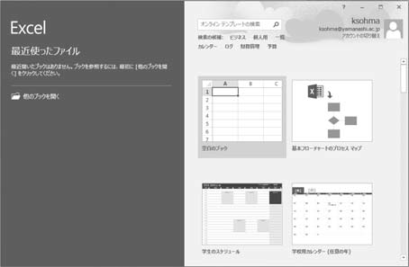
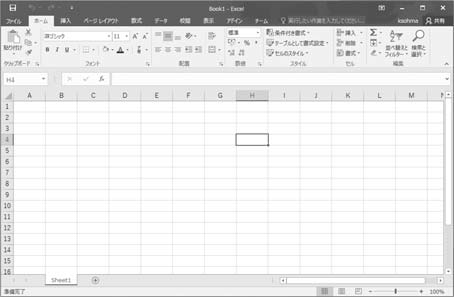
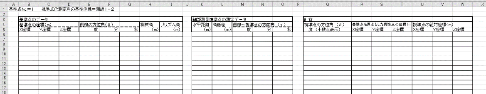
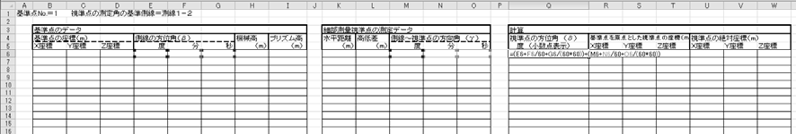
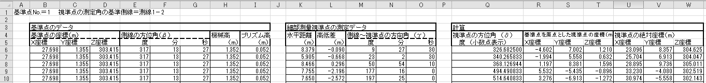
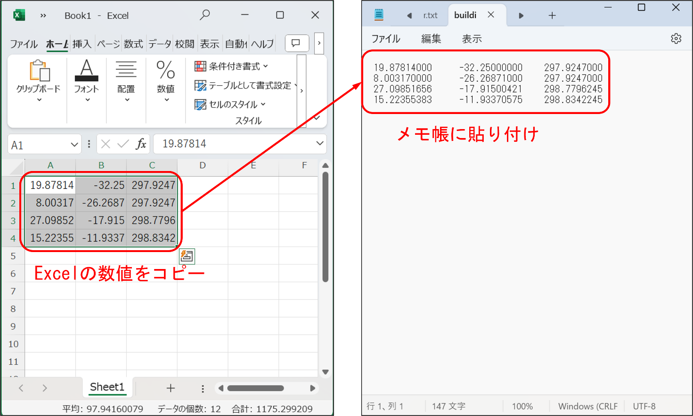
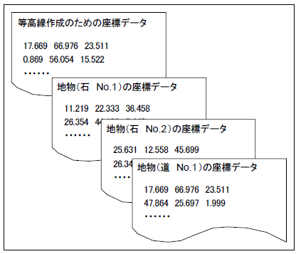

# 8.4.3 QGISへ取り込むためのデータ処理

## Microsoft Excelの起動

- 
- 

マウスで画面左下の「スタート」⇒アプリの一覧から「Excel」をクリック。「空白のブック」をクリック。

## ３次元座標の計算

- 

入力するための表（枠と項目名）を作成する。

- 

座標計算式を入力する。（一行完成させるだけでよい。次項目の入力終了後必要な数（行）を慎重にコピー＆ペーストする）

- 

測量したデータを入力すると座標計算式を入力してあるセルに計算結果が自動的に表示される。

- 

1.  
2.  
3.  

上記の作業は、1つの測量対象ごとに1シート使う。測量対象は下記の通りである。地物の種類（例えば石を10個、建物を2棟、フェンスを1ライン、連続した道を測定した場合は、全部で4シートを作る。つまり、石1シート、建物1シート、フェンス1シート、道1シートである。）等高線を作成するための測定点座標（地物のデータも使用して1シートを作る。）自班の測点座標（測点座標のみで１シートを作る。）なお、石の上で測量したデータを等高線および測点座標として用いる場合は、z座標を地面の高さに修正すること！

## QGISに取り込むためのデータ作成

上記の例では全部で6のシートからなる1つのExcelファイルが作られる。（これを「原データファイル」と呼ぶこととする。）

しかし、このままではQGISにデータを取り込むことができない。QGISに取り込むために必要なデータは3次元座標だけで、その数字は小数点第3位まで記述され、さらにxyzの各データはTab区切りによって区切られていなければならない。また1つの測量対象データは1つのファイルに保存されていることが必要であるため、次の操作を行う。

- 
- 

「メモ帳」を開いておく。Excelの3次元座標の数値のみをコピーし、メモ帳に張り付ける。こうするとタブ区切りでメモ帳に張り付けられる．

- 
- 
- 
- 

「ファイル」から「名前を付けて保存」を選択「参照」で「report7」の中の「qgis」フォルダを選択（0参照）。名前を付ける（例：1班の等高線データは「contour01.txt」、地物の石は「Stones01.txt」など）。「保存」をクリックする。

- - 
  - 
  - 

以上の操作によって、この例では6個のファイルが作成される。地物のファイル4個（石、建物、フェンス、道の各ファイル）等高線のファイル1個（地物のデータも含む）自班の測点座標ファイル1個

図 8.7にQGIS用のデータ作成における注意点のまとめと、データのイメージを示す。

> 図 8.7　QGISに取り込むためのデータ作成上の注意点およびイメージ

- 
- 
- 
- 
- 
- 

<!-- -->

- 

単位はm、小数点以下3桁（＝mm）x座標　y座標　z座標の順座標と座標の間はTABで区切る1座標データ1行各座標データは改行することテキストデータであること等高線の座標データと、地物の座標データにシートを分ける。
