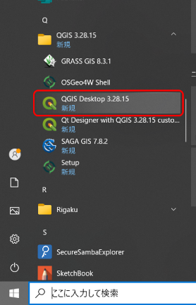
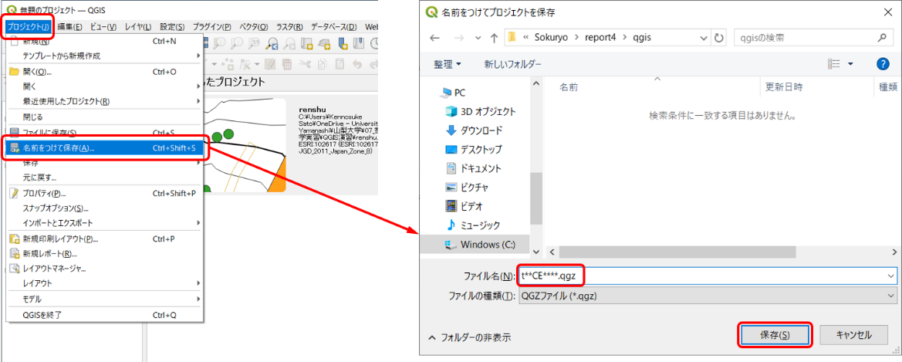

# 8.5.2 QGISの起動とファイルの保存

- - 
  - 
  - 

QGISの起動画面左下の「スタート」検索窓に「qgis」。アプリ一覧から「QGIS\*.\*\*」「QGIS Desktop\*.\*\*.\*」をクリックして起動する。

- - 
  - 
  - 

プロジェクトの保存画面上部の「プロジェクト」「名前を付けて保存」⇒作成した「qgis」フォルダを選択ファイル名を「t\*\*ce\*\*\*\*.qgz」（\*の部分は学籍番号）として保存する。
