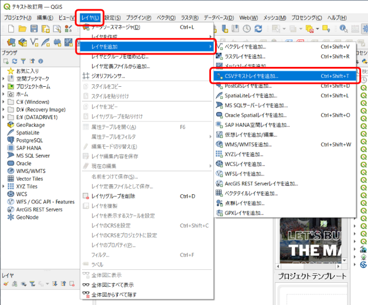
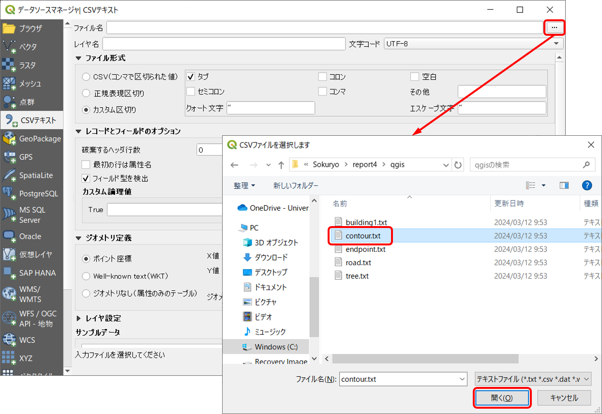
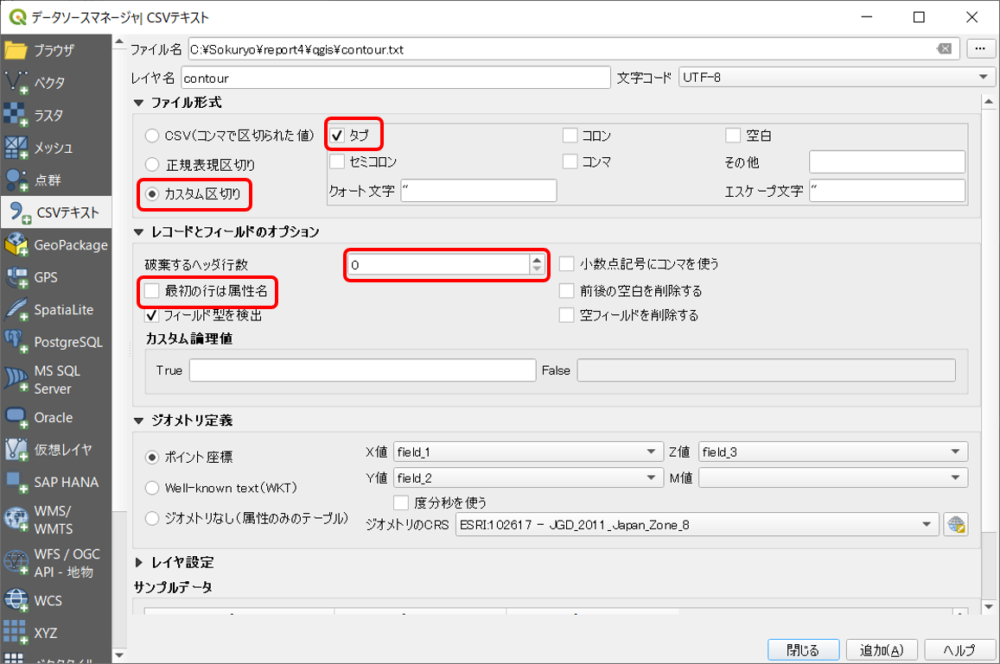
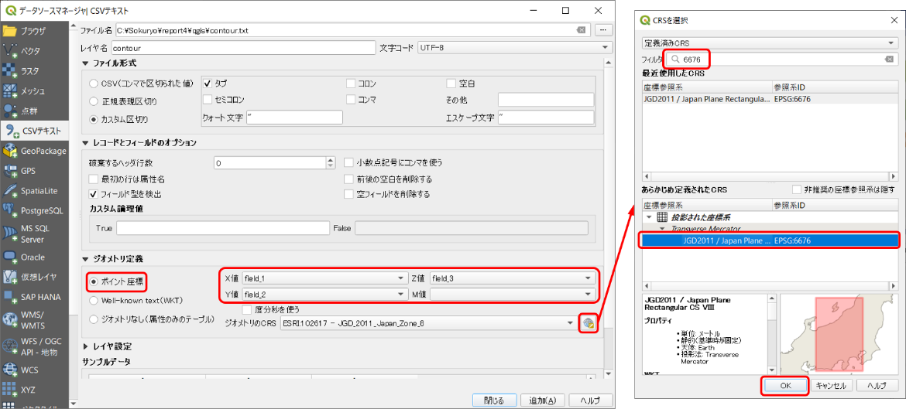
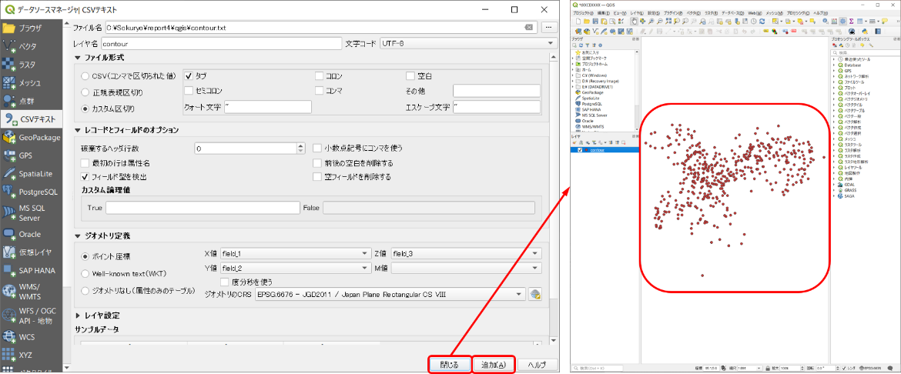

# 8.5.4 測量成果（点データ）の追加

- 
- 
- 

画面上部の「レイヤ」「レイヤを追加」「CSVテキストレイヤを追加」をクリック。

- 
- 
- 

開いたウインドウの「ファイル名」の右のアイコンをクリック作成した「qgis」フォルダを選択等高線作成用のテキストファイル（〇〇.txt）を選択して「開く」をクリック。

- - 
- - 

「ファイル形式」の「カスタム区切り」を選択「タブ」にチェックを入れる。「レコードとフィールドのオプション」の「破棄するヘッダ行数」に0を入力「最初の行は属性名」のチェックを外す。

- - 
- - 
  - 

「ジオメトリ定義」の「ポイント座標」にチェック「X属性」でfield_1、「Y属性」でfield_2、「Z属性」でfield_3を選択。「ジオメトリ定義」の「ジオメトリのCRS」右側のアイコンをクリック「座標参照系の選択」。検索窓に6676と入力すると、「JGD2011/Japan Plane Rectangular CS VIII EPSG:6676」が検索されるので、選択。ここで設定する座標系がデータの持つ座標系である（参照：8.2.2　座標系について）

- - 
  - 

データを追加「追加」「閉じる」をクリックすると等高線用のデータがプロットされる。
