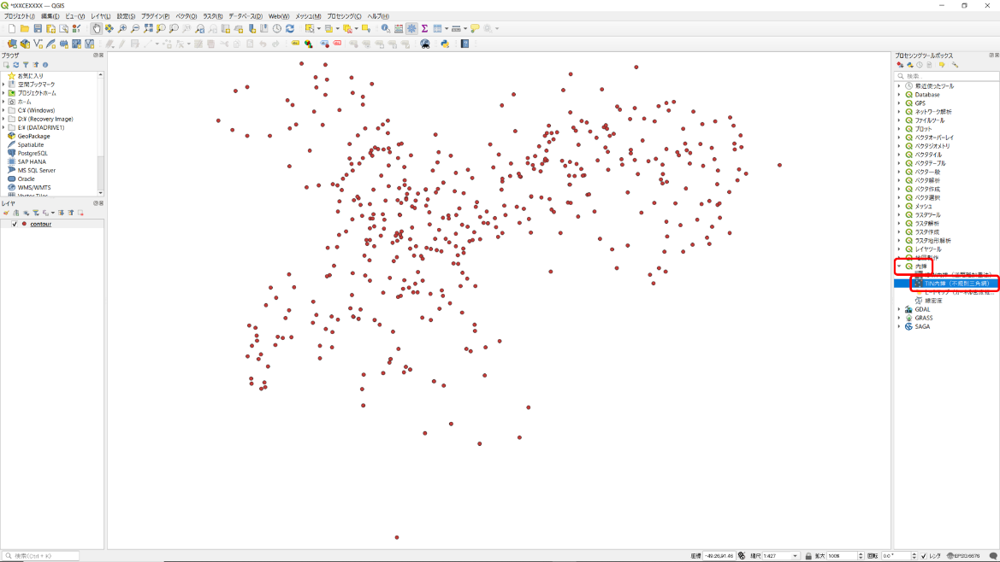
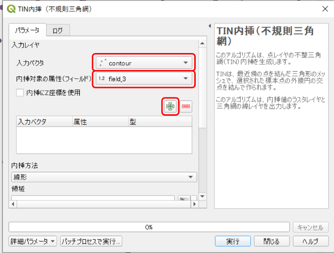
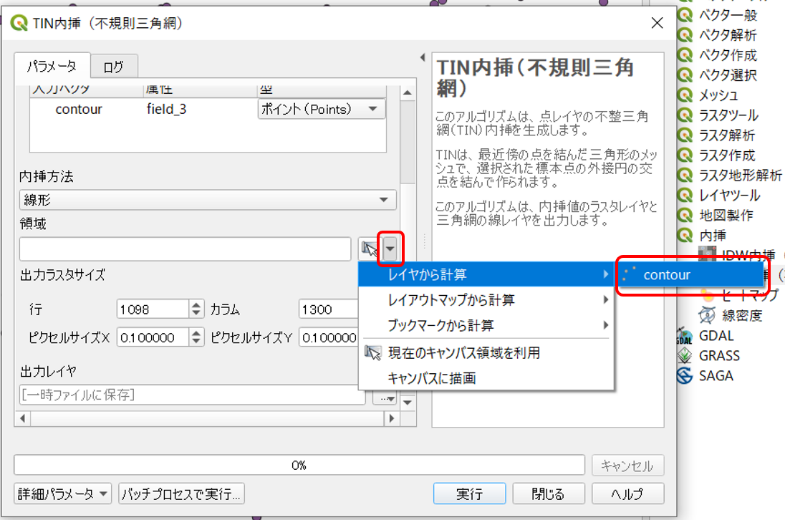
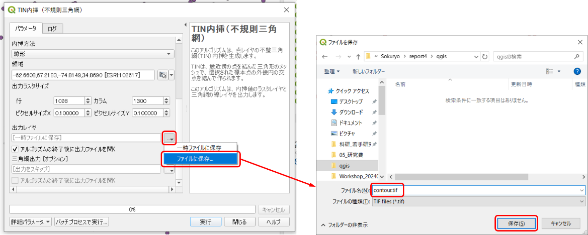
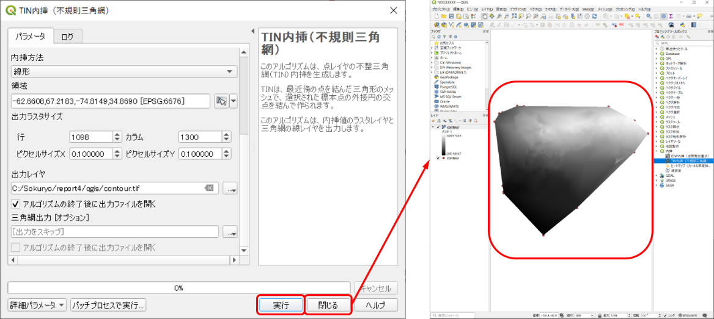

# 8.5.5 点データの内挿補間

- 
- - 

点のデータを面のデータにするためには間を埋めるデータの補間が必要である。様々なやり方が存在するがここではTIN（Triangle Irregular Network、不整三角形網）を用いた補間を行う。この方法は、点データを頂点とする三角形群を生成し、三角形の面としてデータを補間するものである。結果は、格子上のデータであるラスタデータで出力される。右側の「プロセンシングツールボックス」「内挿」⇒「TIN内挿」をダブルクリック。または上部の検索窓にtinと入力すると、検索される。

- - 
  - 

「入力ベクタ」で等高線データをプロットしたレイヤを選択（レイヤ名は等高線作成用のテキストファイル名と同じ）「内挿対象の属性（フィールド）」で「field_3」（z座標値）を選択「＋」をクリック。

- - 
  - 
  - 

データ処理の範囲の選択「領域」の右の▼アイコンをクリック「レイヤから計算」（無い場合は「レイヤの領域を使う」）等高線データをプロットしたレイヤを選択する。

- - 
  - 
  - 
  - 
  - 

出力するファイル名と種類の設定「出力レイヤ」の右側のアイコンをクリック「ファイルに保存」を選択「qgis」フォルダを選択ファイル名を「contour.tif」、ファイルの種類は「TIF files（\*.tif）とする「保存」をクリック。

- 
- 

「実行」「閉じる」をクリックすると等高線を描く領域が塗りつぶされる。
