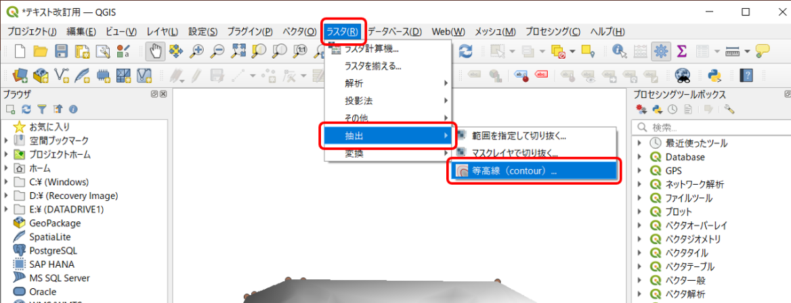
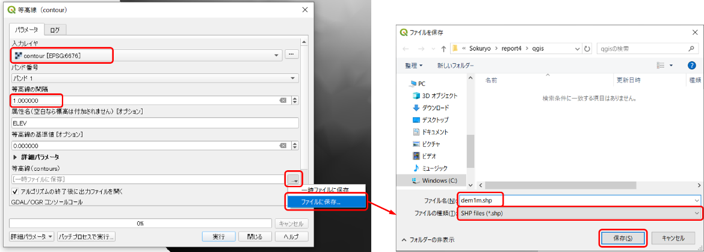
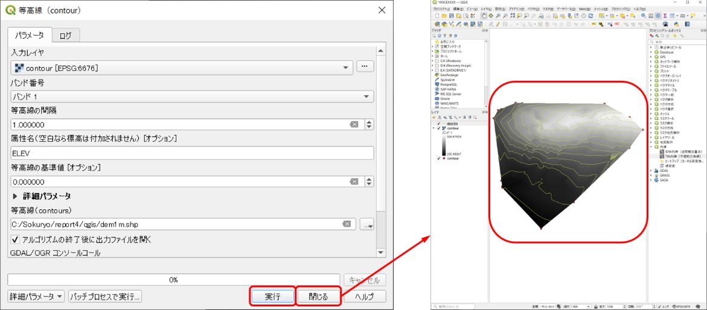
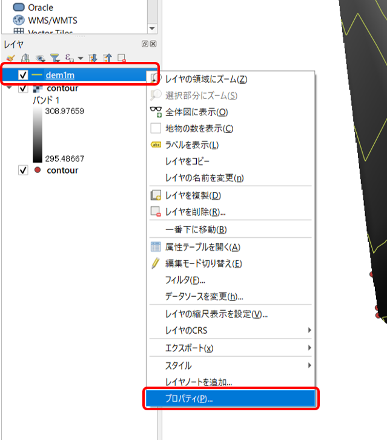
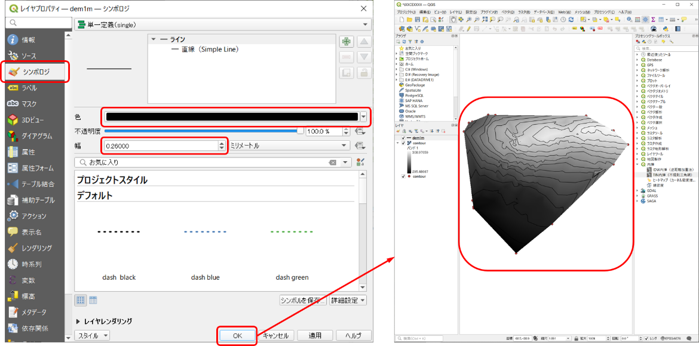
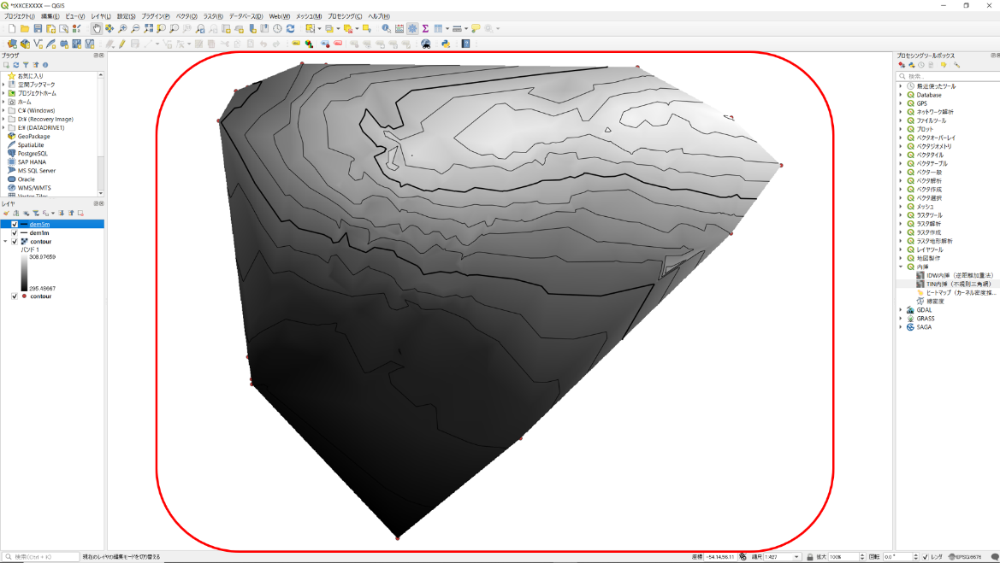
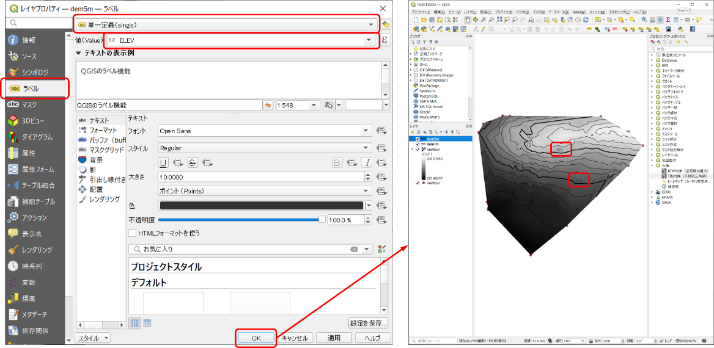

# 8.5.6 等高線の生成

- 

画面上部の「ラスタ」⇒「抽出」⇒「等高線」をクリック。

## 1mの等高線

- 
- 
- - 
  - 
  - 

「入力レイヤ」で「contour \[・・・\]」を選択する。「等高線の間隔」で「1.0」を入力する。下部の「等高線（contours）」の右側のアイコンをクリック「ファイルに保存」「qgis」フォルダを選択名前を「dem1m.shp」、ファイルの種類を「SHP files (\*.shp)」として「保存」する。（.shpファイルについては、8.2.1　参照）

- - 

「実行」「閉じる」をクリックすると1m間隔の等高線が描写される。

- - 

左側の「レイヤ」の中から「dem1m」を右クリック「プロパティ」をクリックする。

- - 
  - 
  - 

「シンポロジ」「色」で黒を選択「幅」で0.260000を選択「OK」をクリックすると等高線の色と太さが変更される。

## 5mの等高線

- 
- 
- - 
  - 
  - 
- - 
- - 
- - 

「入力レイヤ」で「contour\[・・・\]」を選択する。「等高線の間隔」で「5.0」を入力する。「等高線（contours）」の右側のアイコンをクリック「ファイルに保存」「qgis」フォルダを選択名前を「dem5m.shp」、ファイルの種類を「SHP files (\*.shp)」で「保存」。「実行」「閉じる」をクリックすると5m間隔の等高線が描写される。左側の「レイヤ」の中から「dem5m」を右クリック「プロパティ」をクリックする。「シンポロジ」⇒「色」で黒を選択⇒「幅」で0.660000を選択「OK」をクリックすると等高線の色と太さが変更される。

- - 
- - 

左側の「レイヤ」の中から「dem5m」を右クリック「プロパティ」をクリックする。「ラベル」⇒「単一定義」を選択⇒「値」で「ELEV」を選択。「OK」をクリックすると5mの等高線に高さの値がラベル付けされる。

- 
-
