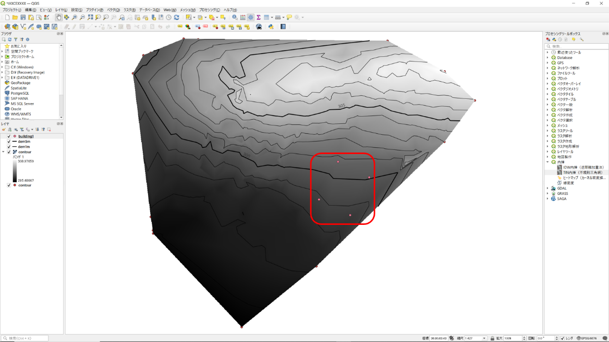
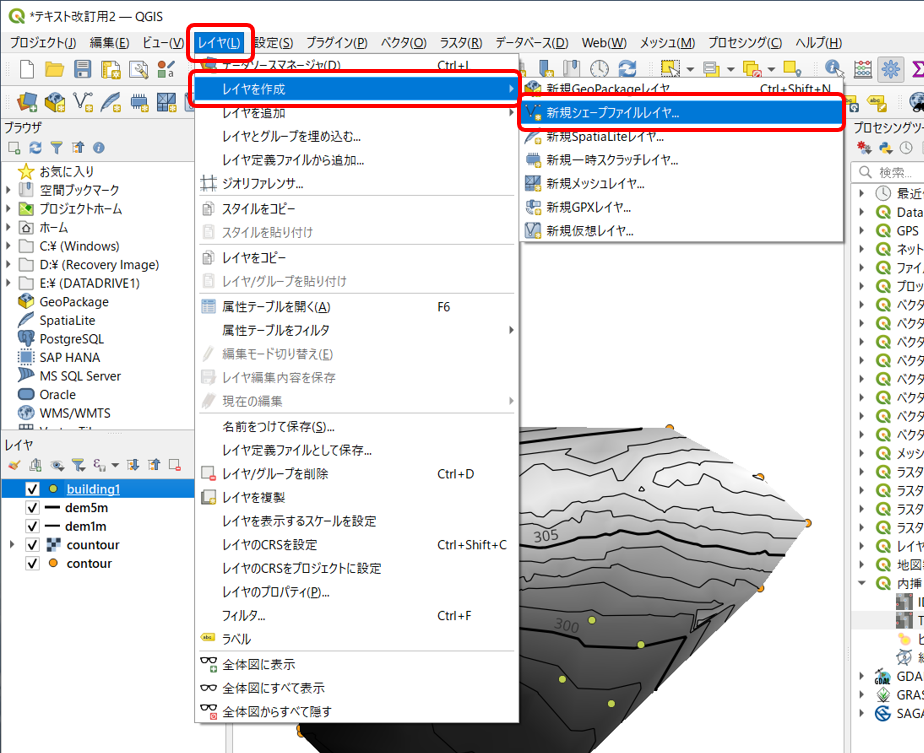
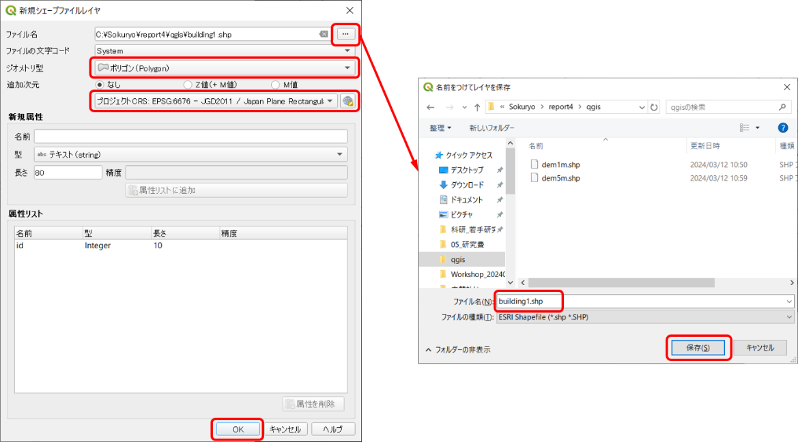
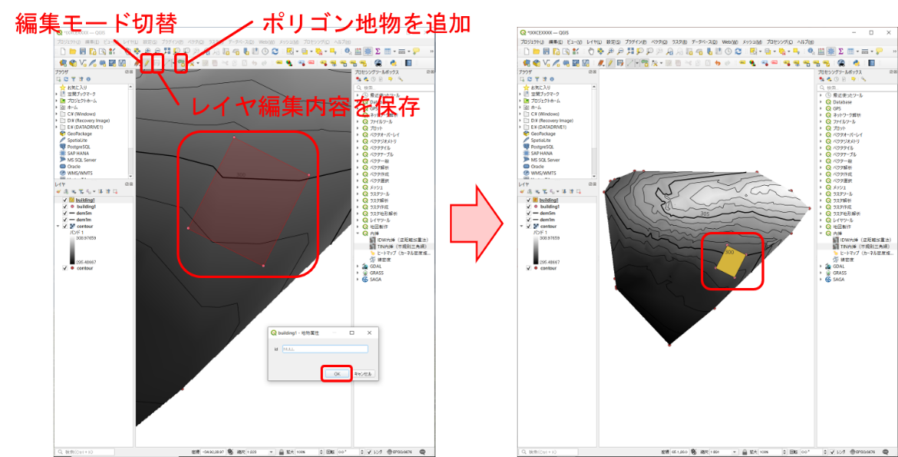
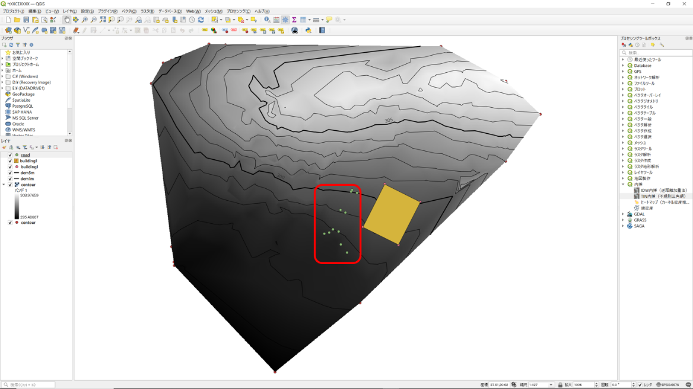
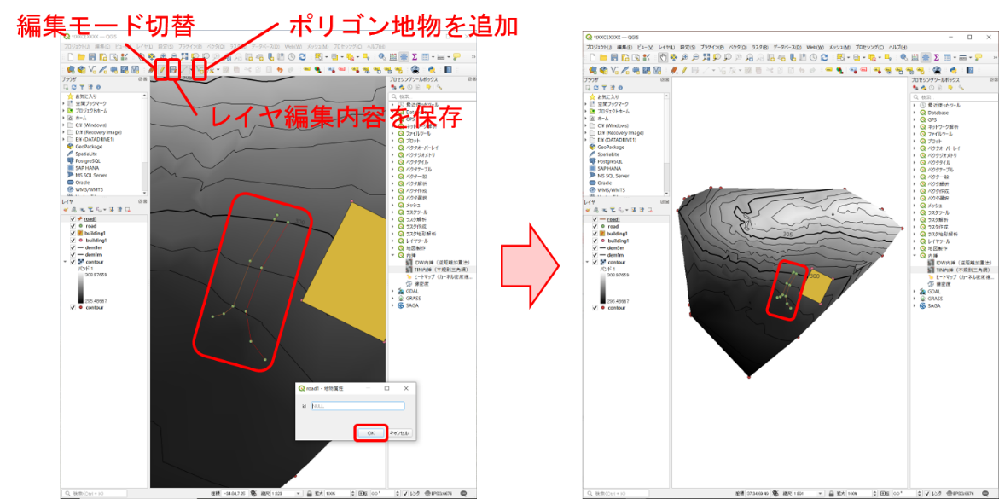
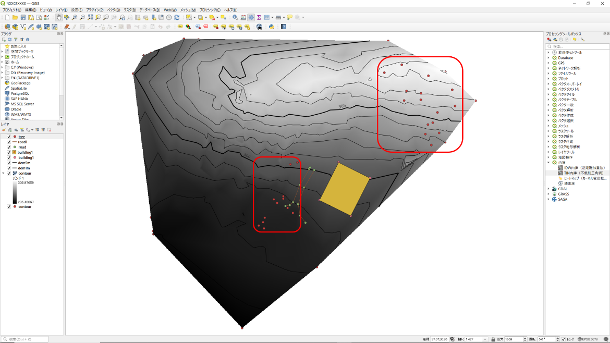
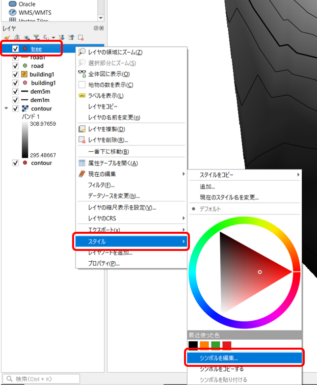
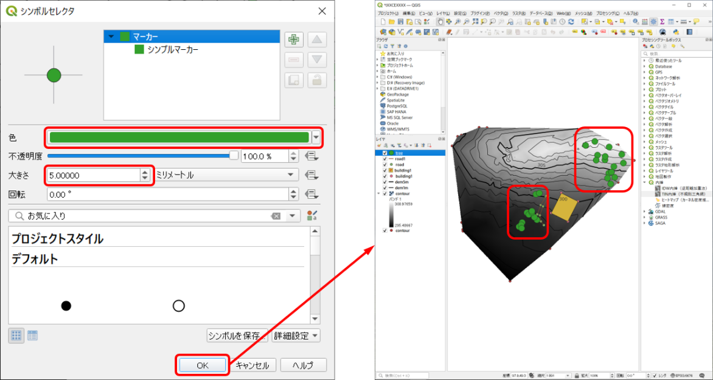
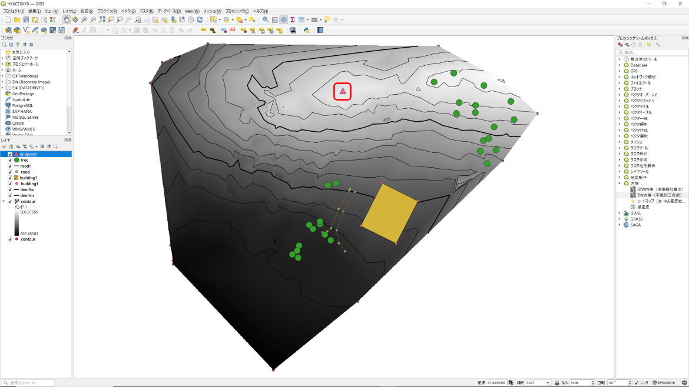

# 8.5.7 地物（建物・道・樹木・石等）の生成

## 建物の作成

- - 
  - 

データのインポートは8.5.4　と同様。建物作成用のテキストファイル（〇〇.txt）を選択する。建物用のデータがプロットされる。

- - 

画面上部の「レイヤ」「レイヤを作成」⇒「新規シェープファイルレイヤ」をクリックする。

- - 
  - 
- - 

「ファイル名」右側のアイコンをクリック「qgis」フォルダを選択ファイル名を「building1.shp」として保存する。「ジオメトリ型」で「ポリゴン」を選択「プロジェクトCRS JGD2011/Japan Plane Rectangular CS VIII EPSG:6676」を選択。「OK」をクリックする。

- - 
  - 
  - 
  - 
  - 
  - 

「編集モード切替」（鉛筆アイコン）「ポリゴン地物を追加」建物の座標にポインタを合わせてクリック（建物に見えるように）最後に右クリック開いたウインドウで「OK」「レイヤ編集内容を保存」「編集モード切替」をクリックすると建物が描写される。

## 道の作成

- - 
  - 

データのインポートは8.5.4　と同様。道作成用のテキストファイル（〇〇.txt）を選択する。道作成用のデータがプロットされる。

- - 
  - 
- 
- 
- 
- - 

画面上部の「レイヤ」「レイヤを作成」「新規シェープファイルレイヤ」をクリックする。「ファイル名」右側のアイコンをクリック「qgis」フォルダを選択ファイル名を「road1.shp」として保存する。「ジオメトリタイプ」で「ラインストリング」を選択「プロジェクトCRS JGD2011/Japan Plane Rectangular CS VIII EPSG:6676」を選択。「OK」をクリックすると道の座標がプロットされる。

- - 
  - 
  - 
  - 

「編集モード切替」（鉛筆アイコン）「線の地物を追加」道の座標にポインタを合わせてクリック（道に見えるように）最後に右クリック⇒「OK」⇒「レイヤ編集内容を保存」「編集モード切替」をクリックすると道が描写される。

## 樹木の作成（頂上も同様）

- - 
  - 

データのインポートは8.5.4　と同様。樹木作成用のテキストファイル（〇〇.txt）を選択する。樹木用のデータがプロットされる。

- 

左の「レイヤ」ウインドウで樹木のレイヤを選択して右クリック  
⇒「スタイル」⇒「シンボルを編集」をクリックする。

- 
- 
- 

「色」は緑色等を選択「大きさ」5.0程度を選択（樹木に見えるように）「OK」をクリックすると樹木が描写される。

- 

頂上（endpoint）も樹木と上記の手順で作成可能。

- 
-
