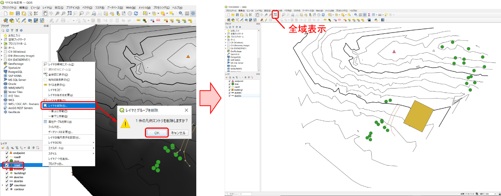
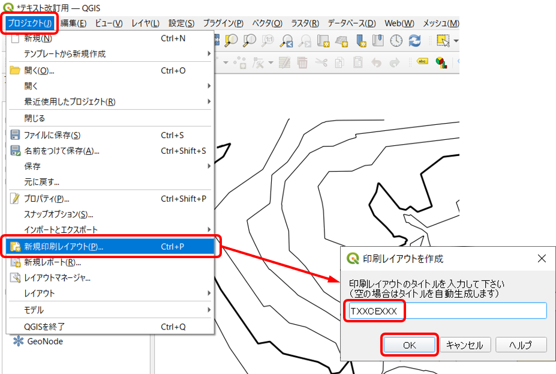
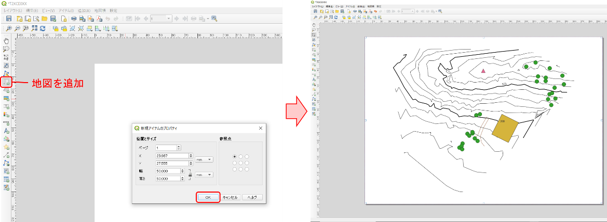
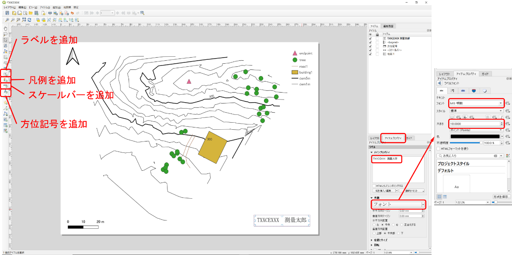
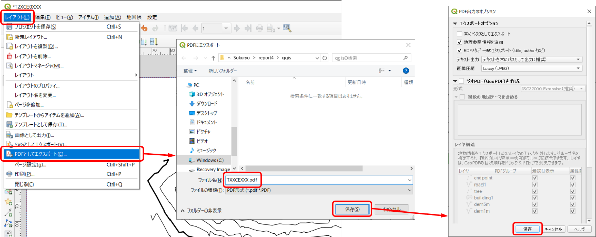

# 8.5.8 地形図を完成させる

- 
- 
- 
- 

左側の「レイヤ」ウインドウで地形図に載せるもの以外を右クリック。「レイヤを削除」開いたウインドウで「OK」「全域表示」をクリックして全体が収まるように表示範囲を調整する。

- - 
  - 

「プロジェクト」「新規印刷レイアウト」学籍番号を入力⇒「OK」をクリックする。

- - 
  - 
  - 

「地図を追加」配置したい場所の左上隅あたりをクリック。開いたウインドウで「OK」をクリック。表示された地図を適当なサイズに調整する。

- 
- - 
  - 
  - 

「地図を追加」と同様の方法で「スケールバーを追加」「方位記号を追加」「凡例を追加」を行う。「ラベルを追加」配置したい場所の左上隅あたりをクリック右側の「アイテムプロパティ」ウインドウの「メインプロパティ」で「ラベルのテキスト」を【学籍番号　氏名】に書き換え「フォント」をクリックしてフォント「MS明朝」、大きさ「18」を選択。

- - 
  - 
  - 

「レイアウト」「pdfとしてエクスポート」「qgis」フォルダを選択「学籍番号.pdf」と入力して「保存」⇒「保存」をクリックする。
